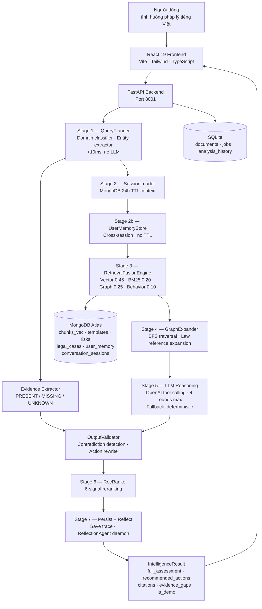

# LexAI — Universal Legal Knowledge Assistant

**Vietnamese Legal Intelligence Infrastructure powered by MongoDB Atlas Vector Search**

[](qa/release_gate_report.md)
[](qa/retrieval_benchmark_report.md)
[](qa/release_gate_report.md)
[](#tech-stack)

---

## Video Demo

**▶ [Xem demo trên YouTube](https://youtu.be/yL13iIu7x-0)**

> Demo live: phân tích tình huống pháp lý đất đai (thu hồi, hòa giải không thành) và hợp đồng (đơn phương chấm dứt) — hệ thống nhận diện đúng giai đoạn pháp lý và gợi ý hành động không mâu thuẫn.

---

## What is LexAI?

LexAI là **Legal Intelligence Infrastructure** — không phải chatbot pháp lý thông thường.

Thay vì chỉ nhận câu hỏi → trả lời, LexAI:

- **Trích xuất evidence status** từ input người dùng (`land_certificate = PRESENT`, `ubnd_mediation = PRESENT_FAILED`)
- **Kiểm tra mâu thuẫn** giữa output AI và evidence đã biết → loại bỏ action không phù hợp
- **Chuyển đổi action template** theo trạng thái pháp lý thực tế (chưa hòa giải vs. hòa giải không thành)
- **Hybrid retrieval fusion**: Vector Search + BM25 + GraphRAG + Behavior trong một Aggregation Pipeline duy nhất
- **Tự báo cáo** giới hạn kỹ thuật qua release gate tự động — không che giấu limitation

> *"Khi pháp luật còn phức tạp — LexAI ở đây để chỉ đường."*

---

## Tài Liệu Kỹ Thuật

### Tài liệu bắt buộc theo yêu cầu cuộc thi

| Hạng mục | File | Mô tả |
|---|---|---|
| **MVP & Kiến trúc hệ thống** | [`submission/MVP_SCOPE.md`](submission/MVP_SCOPE.md) | Phạm vi MVP, tính năng trong/ngoài scope, decision rationale |
| **Kiến trúc tổng thể** | [`submission/TECHNICAL_DOCUMENT.md`](submission/TECHNICAL_DOCUMENT.md) | Full tech stack, 7-stage pipeline, module map, design decisions |
| **Data schema MongoDB** | [`submission/MONGODB_ARCHITECTURE.md`](submission/MONGODB_ARCHITECTURE.md) | Collections, schema, vector indexes, TTL, data isolation model |
| **Vector Search & Aggregation Pipeline** | [`submission/VECTOR_SEARCH_AND_AGGREGATION.md`](submission/VECTOR_SEARCH_AND_AGGREGATION.md) | Index definition, full aggregation pipeline JS code, fusion weights |

### Tài liệu bổ sung

| File | Mô tả |
|---|---|
| [`submission/DEMO_INPUTS_AND_EXPECTED_OUTPUTS.md`](submission/DEMO_INPUTS_AND_EXPECTED_OUTPUTS.md) | 10 câu hỏi demo + kết quả mong đợi cho từng domain |
| [`submission/METRICS_TABLES.md`](submission/METRICS_TABLES.md) | Bảng chi tiết tất cả metrics (accuracy, latency, coverage) |
| [`submission/LIMITATIONS_AND_ROADMAP.md`](submission/LIMITATIONS_AND_ROADMAP.md) | Known limitations (L-01 case_embedding_index) + roadmap |
| [`submission/JUDGING_CRITERIA_MAPPING.md`](submission/JUDGING_CRITERIA_MAPPING.md) | Mapping từng tiêu chí chấm điểm → phần code/doc tương ứng |
| [`submission/INVESTOR_SLIDE_OUTLINE.md`](submission/INVESTOR_SLIDE_OUTLINE.md) | Slide deck cho nhà đầu tư (10 slides) |
| [`submission/INVESTOR_PITCH_SCRIPT.md`](submission/INVESTOR_PITCH_SCRIPT.md) | Kịch bản thuyết trình đầu tư (12 phút) |

### QA & Benchmark

| File | Mô tả |
|---|---|
| [`qa/retrieval_benchmark_report.md`](qa/retrieval_benchmark_report.md) | Kết quả benchmark 30 queries — 96.6% top-1 accuracy |
| [`qa/retrieval_benchmark_results.json`](qa/retrieval_benchmark_results.json) | Raw JSON benchmark data |
| [`qa/release_gate_report.md`](qa/release_gate_report.md) | Release gate HG-1 đến HG-6 — PASS_BETA |
| [`qa/release_gate_report.json`](qa/release_gate_report.json) | Machine-readable gate results |
| [`qa/manual_qa_results.json`](qa/manual_qa_results.json) | 15/15 manual QA scenarios |
| [`qa/api_smoke_report.md`](qa/api_smoke_report.md) | API smoke test results |

---

## Key Metrics

| Metric | Value | Target | Status |
|---|---|---|---|
| Automated test suite | **365 / 365 pass** | 100% | ✅ |
| Top-1 domain accuracy | **96.6%** (28/29) | ≥ 85% | ✅ |
| Cross-domain error | **0.0%** | 0% | ✅ |
| Manual QA scenarios | **15 / 15 pass** | 15/15 | ✅ |
| P0 contradictions | **0** | 0 | ✅ |
| API 500 errors | **0** | 0 | ✅ |
| Beta release gate | **PASS\_BETA** | — | ✅ |

---

## System Architecture



> Tài liệu đầy đủ: [`submission/TECHNICAL_DOCUMENT.md`](submission/TECHNICAL_DOCUMENT.md) · [`submission/MVP_SCOPE.md`](submission/MVP_SCOPE.md)

---

## MongoDB Architecture

### Database: `legal_knowledge_assistant` (MongoDB Atlas M0)

**Embedding model:** `paraphrase-multilingual-MiniLM-L12-v2` · 384 dimensions · cosine similarity

### Collections

| Collection | Purpose | Vector Index | TTL |
|---|---|---|---|
| `chunks_vec` | Law chunks with 384-dim embeddings | `chunk_embedding_index` ✅ | — |
| `templates` | Pre-seeded contract templates | `template_embedding_index` ✅ | — |
| `risks` | Legal risk patterns | `risk_embedding_index` ✅ | — |
| `legal_cases` | Similar case descriptions | `case_embedding_index` ❌ Atlas M0 limit | — |
| `interactions` | User behavior log | — | — |
| `conversation_sessions` | Multi-turn session context | — | **24h TTL** |
| `user_memory` | Cross-session user memory | — | **None** |
| `community_case_patterns` | Anonymized community patterns | — | — |

### Core Schema: `chunks_vec`

```json
{
  "_id": "ObjectId",
  "chunk_id": "doc_abc123_chunk_0042",
  "doc_id": "doc_abc123",
  "user_id": "admin",
  "is_global": true,
  "content": "Điều 202 Luật Đất đai 2013 quy định tranh chấp đất đai phải...",
  "law_type": "dat_dai",
  "law_reference": "Điều 202 Luật Đất đai 2013",
  "embedding": [0.0234, -0.1123, 0.0892, "...384 dims total"],
  "metadata": {
    "chunk_index": 42,
    "page": 87,
    "processing_version": "v2.1",
    "confidence": 0.94
  },
  "created_at": "2026-05-30T10:00:00Z"
}
```

### Data Isolation Model

```
is_global = true   →  uploaded by admin  →  visible to ALL users
is_global = false  →  uploaded by user   →  visible ONLY to that user
```

Every retrieval query applies:
```javascript
{ $or: [{ user_id: userId }, { is_global: true }] }
```

> Schema đầy đủ + TTL config: [`submission/MONGODB_ARCHITECTURE.md`](submission/MONGODB_ARCHITECTURE.md)

---

## Vector Search & Aggregation Pipeline

### Tại sao cần Vector Search?

Vietnamese legal text có những thách thức đặc thù:
- Người dùng hỏi bằng ngôn ngữ tự nhiên — không biết số điều khoản
- Cùng khái niệm có nhiều dạng: `"sổ đỏ"` = `"GCN QSDĐ"` = `"giấy chứng nhận quyền sử dụng đất"`
- Query không dấu: `"so do bi tranh chap phai lam gi"` vẫn phải resolve đúng

Keyword exact match là không đủ. Vector Search tìm **văn bản tương đồng về nghĩa** dù không trùng từ khóa.

### Vector Search Index Definition

```json
{
  "name": "chunk_embedding_index",
  "type": "vectorSearch",
  "definition": {
    "fields": [
      { "type": "vector", "path": "embedding", "numDimensions": 384, "similarity": "cosine" },
      { "type": "filter", "path": "user_id" },
      { "type": "filter", "path": "is_global" },
      { "type": "filter", "path": "law_type" }
    ]
  }
}
```

### Aggregation Pipeline — Hybrid Retrieval Fusion

```javascript
db.chunks_vec.aggregate([
  // Stage 1: ANN Vector Search với data-isolation filter
  {
    $vectorSearch: {
      index: "chunk_embedding_index",
      path: "embedding",
      queryVector: queryEmbedding,   // 384-dim float array
      numCandidates: 100,
      limit: 20,
      filter: { $or: [{ user_id: userId }, { is_global: true }] }
    }
  },
  // Stage 2: Lấy vector score + áp threshold
  { $addFields: { vector_score: { $meta: "vectorSearchScore" } } },
  { $match: { vector_score: { $gte: 0.55 } } },
  // Stage 3: Filter theo domain pháp lý đã phân loại
  { $match: { law_type: detectedDomain } },
  // Stage 4: BM25 TF approximation (không cần IDF corpus)
  {
    $addFields: {
      bm25_score: {
        $divide: [
          { $size: { $filter: { input: queryTerms, as: "t",
              cond: { $regexMatch: { input: "$content", regex: "$$t", options: "i" } }
          }}},
          { $add: [{ $strLenCP: "$content" }, 1] }
        ]
      }
    }
  },
  // Stage 5: Fusion score (tổng weights = 1.0)
  {
    $addFields: {
      fusion_score: {
        $add: [
          { $multiply: ["$vector_score",   0.45] },
          { $multiply: ["$bm25_score",     0.20] },
          { $multiply: ["$graph_score",    0.25] },
          { $multiply: ["$behavior_score", 0.10] }
        ]
      }
    }
  },
  { $sort: { fusion_score: -1 } },
  { $limit: 10 },
  { $project: { embedding: 0 } }
])
```

### Retrieval Fusion Weights

| Signal | Weight | Nguồn |
|---|---|---|
| Vector Search (semantic) | **0.45** | MongoDB `$vectorSearch`, cosine similarity |
| GraphRAG (law reference expansion) | **0.25** | BFS traversal từ law entity nodes |
| BM25 (keyword TF) | **0.20** | TF approximation trên trường `content` |
| Behavior (interaction history) | **0.10** | User view/save/download từ collection `interactions` |

> Pipeline đầy đủ + giải thích chi tiết: [`submission/VECTOR_SEARCH_AND_AGGREGATION.md`](submission/VECTOR_SEARCH_AND_AGGREGATION.md)

---

## 7-Stage Intelligence Pipeline

| Stage | Module | Mô tả |
|---|---|---|
| 1 | `src/engine/query_planner.py` | Domain classification — keyword scoring, <10ms, no LLM |
| 2 | `src/memory/session_store.py` | Load 24h TTL MongoDB session context |
| 2b | `src/memory/user_memory_store.py` | Load permanent cross-session user memory |
| 3 | `src/engine/retrieval_fusion.py` | Hybrid Vector+BM25+Graph+Behavior fusion |
| 4 | `src/graphrag/traversal.py` | BFS graph expansion từ law references |
| 5 | `src/agents/legal_agent.py` | OpenAI tool-calling (4 rounds max) + deterministic fallback |
| 6 | `src/engine/recommendation_ranker.py` | 6-signal reranking |
| 7 | `src/engine/orchestrator.py` | Persist trace + ReflectionAgent daemon thread |

### OutputValidator — Contradiction Detection (S-05 P0 Fix)

```python
# Không đề xuất action mâu thuẫn với evidence đã biết
if evidence["land_certificate"] == "PRESENT":
    actions = [a for a in actions if not _matches_land_supplement(a)]
    # Loại bỏ: "thu thập sổ đỏ", "xin cấp GCN", "bổ sung sổ đỏ"

if _is_post_mediation_failed(situation):
    # Switch từ standard actions → court-path actions
    actions = _DAT_DAI_POST_MEDIATION_ACTIONS
    # Loại bỏ: "hòa giải tại UBND" (đã thử và thất bại)
```

25 regression tests: `tests/test_output_validator.py`

### 6-Signal Recommendation Ranker

| Signal | Weight | Formula |
|---|---|---|
| Semantic similarity | 0.35 | cosine(query_vec, chunk_vec) |
| Graph relevance | 0.20 | BFS edge weight sum |
| Behavior (user history) | 0.15 | exp(-0.08 × days) decay |
| Freshness | 0.15 | exp(-ln(2)/180 × days) — half-life 180 days |
| Popularity | 0.10 | interaction count normalized |
| Accepted (feedback) | 0.05 | user accept/reject signal |

---

## 8-Stage Document Ingestion Pipeline

```
Upload → OCR Cleaner → Layout Profiler → Structurer
       → Chunker → Graph Builder → Embed 384-dim → MongoDB Atlas
```

| Stage | Module | Output |
|---|---|---|
| 1 — Extract | `src/pipeline/extractor.py` | Raw text từ PDF/DOCX/HTML/image |
| 2 — Profile | `src/pipeline/profiler.py` | Layout metadata |
| 3 — Clean | `src/pipeline/cleaner.py` | OCR corrections, normalization |
| 4 — Structure | `src/pipeline/structurer.py` | Canonical legal schema |
| 5 — Chunk | `src/pipeline/chunker.py` | Legal-boundary chunks |
| 6 — Graph | `src/pipeline/graph_builder.py` | Law reference graph (nodes + edges) |
| 7 — Embed | `src/pipeline/embedding_stage.py` | 384-dim vectors → MongoDB |
| 8 — Index | `src/pipeline/retrieval_stage.py` | Search index update |

Admin uploads (`user_id == "admin"`) tự động set `is_global=True`.

---

## Legal Domains

| Code | Domain | Sample Keywords |
|---|---|---|
| `dat_dai` | Land law | đất, sổ đỏ, quyền sử dụng đất, thu hồi, lấn chiếm |
| `hop_dong` | Contract law | hợp đồng, vi phạm, đặt cọc, phạt, đơn phương chấm dứt |
| `lao_dong` | Labour law | lao động, sa thải, lương, bhxh, tai nạn lao động |
| `dan_su` | Civil law | thừa kế, di chúc, bồi thường dân sự |
| `gia_dinh` | Family law | hôn nhân, ly hôn, nuôi con, cấp dưỡng |
| `hanh_chinh` | Administrative law | khiếu nại, quyết định hành chính, ubnd |
| `doanh_nghiep` | Corporate law | công ty, cổ đông, phá sản, vốn điều lệ |
| `general` | Fallback | — |

---

## QA & Benchmarking

### Test Suite

```bash
python -m pytest tests/ -q
# 365 passed in ~44s
```

### Retrieval Benchmark (30 queries)

```bash
python scripts/benchmark_retrieval.py --mode http
```

| Metric | Value | Target | Status |
|---|---|---|---|
| Top-1 domain accuracy | **96.6%** | ≥ 85% | ✅ |
| Top-3 domain accuracy | **96.6%** | ≥ 90% | ✅ |
| Cross-domain error | **0.0%** | 0% | ✅ |
| Empty rate | **0.0%** | 0% | ✅ |

Full results: [`qa/retrieval_benchmark_report.md`](qa/retrieval_benchmark_report.md) · [`qa/retrieval_benchmark_results.json`](qa/retrieval_benchmark_results.json)

### Release Gate

```bash
python scripts/qa_release_gate.py --manual-qa qa/manual_qa_results.json
```

| Gate | Status |
|---|---|
| HG-1: P0 contradictions = 0 | ✅ |
| HG-2: Forbidden phrases = 0 | ✅ |
| HG-3: API 500 errors = 0 | ✅ |
| HG-4: Demo labelling correct | ✅ |
| HG-5: Cross-domain error = 0% | ✅ |
| HG-6: Score threshold leak = 0 | ✅ |
| **Beta release** | ✅ **PASS\_BETA** |

Full report: [`qa/release_gate_report.md`](qa/release_gate_report.md)

---

## Tech Stack

| Layer | Technology |
|---|---|
| **Database** | MongoDB Atlas M0 — Vector Search, TTL indexes, Aggregation Pipeline |
| **Embedding** | `paraphrase-multilingual-MiniLM-L12-v2` — 384-dim, multilingual (Vi + En) |
| **Backend** | Python 3.11 · FastAPI · pymongo 4.x · sentence-transformers |
| **LLM** | OpenAI API (tool-calling, 4 rounds max) + deterministic fallback |
| **Frontend** | React 19 · TypeScript · Vite · Tailwind CSS |
| **Storage** | MongoDB Atlas (vectors, sessions, memory) + SQLite (documents, jobs) |
| **Testing** | pytest · 365 automated tests · benchmark script · automated release gate |

---

## Running Locally

### 1. Backend

```bash
pip install -r requirements.txt

# Environment variables (.env)
MONGO_URI="mongodb+srv://..."         # MongoDB Atlas connection string
OPENAI_API_KEY="sk-..."               # Optional — falls back to deterministic
ADMIN_API_KEY="lexai-admin-secret"    # Default value

python -m uvicorn src.api.app:app --host 0.0.0.0 --port 8001 --reload
```

### 2. Seed global knowledge base (một lần)

```bash
python scripts/seed_raw_data.py
# Uploads raw_data/*.doc/*.pdf as is_global=True
# Idempotent — safe to re-run
```

### 3. Frontend

```bash
cd "lexai-–-trợ-lý-pháp-lý-thông-minh UI"
npm install
npm run dev
# → http://localhost:3000         (user app)
# → http://localhost:3000/admin   (admin panel, key: lexai-admin-secret)
```

### 4. Quick API test

```bash
curl -X POST http://localhost:8001/intelligence/analyze \
  -H "Content-Type: application/json" \
  -H "X-User-ID: demo_user" \
  -d '{
    "situation": "Tôi đã có sổ đỏ, hàng xóm xây tường lấn 50cm đất của tôi, tôi cần làm gì?",
    "user_id": "demo_user"
  }'
```

Expected: `detected_domain: "dat_dai"`, recommended actions bao gồm "đo đạc ranh giới" và "hòa giải", **KHÔNG** bao gồm "thu thập sổ đỏ" (evidence đã có).

---

## Project Structure

```
src/                          # Python backend
├── engine/                   # 7-Stage Intelligence Pipeline
│   ├── orchestrator.py       # Main coordinator
│   ├── query_planner.py      # Stage 1 — domain classifier, entity extractor
│   ├── retrieval_fusion.py   # Stage 3 — hybrid Vector+BM25+Graph+Behavior
│   └── recommendation_ranker.py  # Stage 6 — 6-signal reranker
├── memory/
│   ├── session_store.py      # 24h TTL MongoDB session
│   ├── user_memory_store.py  # Cross-session user memory (no TTL)
│   └── reflection_agent.py   # Post-turn extraction daemon
├── mongodb/
│   ├── client.py             # MongoDB Atlas connection
│   └── mongo_storage.py      # VectorStorage — all MongoDB operations
├── pipeline/                 # 8-Stage Document Ingestion
├── graphrag/                 # GraphRAG traversal + evidence bundle
├── agents/                   # LegalAgent + OpenAI tool definitions
├── api/                      # FastAPI routes, Pydantic models, deps
└── recommenders/             # Domain-specific recommenders (6 types)

tests/                        # 365 automated tests

qa/                           # Benchmark + release gate reports
├── retrieval_benchmark_report.md    # 96.6% top-1 accuracy
├── retrieval_benchmark_results.json
├── release_gate_report.md           # PASS_BETA
├── release_gate_report.json
├── manual_qa_results.json           # 15/15 scenarios
└── api_smoke_report.md

submission/                   # Tài liệu kỹ thuật
├── MVP_SCOPE.md                         # MVP scope & decisions
├── TECHNICAL_DOCUMENT.md                # Kiến trúc hệ thống tổng thể
├── MONGODB_ARCHITECTURE.md              # Data schema MongoDB
├── VECTOR_SEARCH_AND_AGGREGATION.md     # Vector Search & Pipeline
├── DEMO_INPUTS_AND_EXPECTED_OUTPUTS.md  # 10 demo scenarios
├── METRICS_TABLES.md                    # All metrics
├── JUDGING_CRITERIA_MAPPING.md          # Judging criteria map
├── LIMITATIONS_AND_ROADMAP.md           # Known limits + roadmap
├── INVESTOR_SLIDE_OUTLINE.md            # Investor pitch deck (10 slides)
├── INVESTOR_PITCH_SCRIPT.md             # Investor pitch script (12 min)
└── screenshots/                         # 21 UI screenshots

scripts/
├── seed_raw_data.py           # Seed global knowledge base
├── benchmark_retrieval.py     # 30-query retrieval benchmark
└── qa_release_gate.py         # Automated release gate

lexai-–-trợ-lý-pháp-lý-thông-minh UI/   # React 19 frontend (20+ pages)
```

---

## Known Limitations

**L-01 — `case_embedding_index` blocked by Atlas M0 limit**

MongoDB Atlas M0 cho phép tối đa 3 vector search indexes. Tất cả đều đã được sử dụng:
- `chunk_embedding_index` (chunks_vec) ✅
- `template_embedding_index` (templates) ✅
- `risk_embedding_index` (risks) ✅

`case_embedding_index` trên `legal_cases` không thể tạo → similar cases dùng `is_demo=True` fallback.

Đây **không phải bug code** — domain classification, law retrieval, OutputValidator, và evidence extraction đều hoạt động đúng.

Fix: Nâng Atlas M0 → M10+ → tạo `case_embedding_index` → GA gate pass.

Release gate phát hiện và báo cáo minh bạch. Không bao giờ suppress.

> Chi tiết: [`submission/LIMITATIONS_AND_ROADMAP.md`](submission/LIMITATIONS_AND_ROADMAP.md)

---

## License

MIT — for educational and research purposes only.  
LexAI does not provide legal advice. Always consult a licensed attorney for legal matters.
