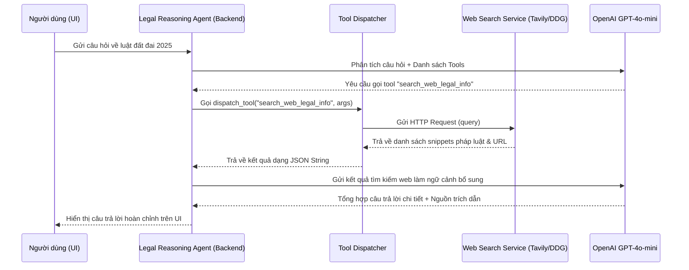

# Hướng dẫn Tích hợp: Công cụ Tìm kiếm Internet (Web Search Tool) cho LexAI

Tài liệu này hướng dẫn chi tiết cách tích hợp công cụ Tìm kiếm trực tuyến vào hệ thống **Agent với Tool Calling** của LexAI để hỗ trợ trả lời các câu hỏi về văn bản pháp lý mới ban hành (ví dụ: Luật Đất đai 2024 có hiệu lực 2024-2025) hoặc tin tức sự kiện pháp lý thực tế gần đây.

---

## 1. Kiến trúc luồng hoạt động (Data Flow)



---

## 2. Các bước triển khai chi tiết

### Bước 1: Khai báo Tool trong `src/llm/tool_calling.py`

Mở file `src/llm/tool_calling.py` và thêm định nghĩa tool `SEARCH_WEB_LEGAL_INFO` vào danh sách:

```python
# ---------------------------------------------------------------------------
# Individual tool definitions
# ---------------------------------------------------------------------------

SEARCH_WEB_LEGAL_INFO: Dict[str, Any] = {
    "type": "function",
    "function": {
        "name": "search_web_legal_info",
        "description": (
            "Tìm kiếm thông tin pháp luật, văn bản mới ban hành, tin tức "
            "về các vụ án, tranh chấp thực tế gần đây trên Internet."
        ),
        "parameters": {
            "type": "object",
            "properties": {
                "query": {
                    "type": "string",
                    "description": "Từ khóa tìm kiếm (ví dụ: 'Quy định mới về bảng giá đất năm 2025')",
                },
                "limit": {
                    "type": "integer",
                    "description": "Số lượng kết quả mong muốn (mặc định 5, tối đa 8)",
                    "default": 5,
                }
            },
            "required": ["query"],
        },
    },
}
```

Bổ sung tool này vào danh sách `SITUATION_TOOLS` và `ALL_LEGAL_TOOLS` ở cuối file:

```python
SITUATION_TOOLS: List[Dict[str, Any]] = [
    RETRIEVE_RELEVANT_LAWS,
    RETRIEVE_SIMILAR_CASES,
    RETRIEVE_GRAPH_CONTEXT,
    SEARCH_WEB_LEGAL_INFO,  # Thêm vào đây
]

ALL_LEGAL_TOOLS: List[Dict[str, Any]] = [
    RETRIEVE_RELEVANT_LAWS,
    RETRIEVE_SIMILAR_CASES,
    ANALYZE_CONTRACT_RISKS,
    GENERATE_COMPLIANCE_CHECKLIST,
    RETRIEVE_GRAPH_CONTEXT,
    SEARCH_WEB_LEGAL_INFO,  # Thêm vào đây
]
```

---

### Bước 2: Viết Hàm xử lý trong `src/agents/tools.py`

Mở file `src/agents/tools.py` và thêm hàm triển khai `search_web_legal_info`:

```python
import os
import json
import requests
import logging

logger = logging.getLogger(__name__)

def search_web_legal_info(query: str, limit: int = 5) -> str:
    """
    Tìm kiếm thông tin internet thông qua Tavily API.
    Nếu không cấu hình API Key, tự động fallback về DuckDuckGo Search miễn phí.
    """
    api_key = os.getenv("TAVILY_API_KEY")
    
    # 1. Fallback về DuckDuckGo (Hoàn toàn miễn phí, không cần key)
    if not api_key:
        logger.info("TAVILY_API_KEY not found. Fallback to DuckDuckGo search.")
        try:
            from duckduckgo_search import DDGS
            results = []
            with DDGS() as ddgs:
                ddg_results = ddgs.text(query, max_results=limit)
                for r in ddg_results:
                    results.append({
                        "title": r.get("title"),
                        "url": r.get("href"),
                        "content": r.get("body")
                    })
            return json.dumps({
                "source": "DuckDuckGo Search",
                "results": results,
                "note": "Kết quả tìm kiếm công cộng."
            }, ensure_ascii=False)
        except Exception as e:
            logger.error("DuckDuckGo search failed: %s", e)
            return json.dumps({
                "error": "Vui lòng cấu hình TAVILY_API_KEY trong .env để kích hoạt tìm kiếm trực tuyến chất lượng cao."
            }, ensure_ascii=False)
            
    # 2. Sử dụng Tavily API (Tối ưu nhất cho RAG/Agent)
    url = "https://api.tavily.com/search"
    payload = {
        "api_key": api_key,
        "query": query,
        "search_depth": "advanced",  # Tìm kiếm chuyên sâu cho phân tích pháp lý
        "max_results": limit
    }
    
    try:
        response = requests.post(url, json=payload, timeout=10)
        data = response.json()
        raw_results = data.get("results", [])
        
        results = [
            {
                "title": r.get("title", ""),
                "url": r.get("url", ""),
                "content": r.get("content", "")
            }
            for r in raw_results
        ]
        
        return json.dumps({
            "source": "Tavily AI Search",
            "results": results
        }, ensure_ascii=False)
        
    except Exception as e:
        logger.error("Tavily API call failed: %s", e)
        return json.dumps({"error": f"Lỗi kết nối API tìm kiếm: {str(e)}"}, ensure_ascii=False)
```

Đăng ký tool trong hàm `dispatch_tool` ở cuối file `src/agents/tools.py`:

```python
        elif tool_name == "retrieve_graph_context":
            return retrieve_graph_context(
                law_references=tool_args.get("law_references", []),
                vector_storage=vector_storage,
                depth=int(tool_args.get("depth", 2)),
            )
        elif tool_name == "search_web_legal_info":  # Đăng ký tại đây
            return search_web_legal_info(
                query=tool_args.get("query", ""),
                limit=int(tool_args.get("limit", 5))
            )
```

---

### Bước 3: Cấu hình Môi trường (`.env`)

Để cài đặt các thư viện cần thiết, hãy thêm vào file `requirements.txt`:
```text
duckduckgo-search>=6.0.0
```

Thêm biến cấu hình môi trường vào file `.env` ở thư mục gốc:
```env
# Tavily AI Search Key (Đăng ký miễn phí tại tavily.com)
TAVILY_API_KEY="tvly-your-actual-api-key-here"
```

---

## 3. Hướng dẫn kiểm thử (Testing)

Bạn có thể chạy thử nghiệm tích hợp thông qua file script kiểm thử nhanh `tests/test_web_search.py`:

```python
import dotenv
from src.agents.tools import search_web_legal_info

dotenv.load_dotenv()

def test_search():
    print("Đang thử nghiệm tìm kiếm thông tin luật đất đai 2025...")
    res = search_web_legal_info("Quy định mới về bảng giá đất năm 2025", limit=3)
    print("\nKết quả trả về:")
    print(res)

if __name__ == "__main__":
    test_search()
```
