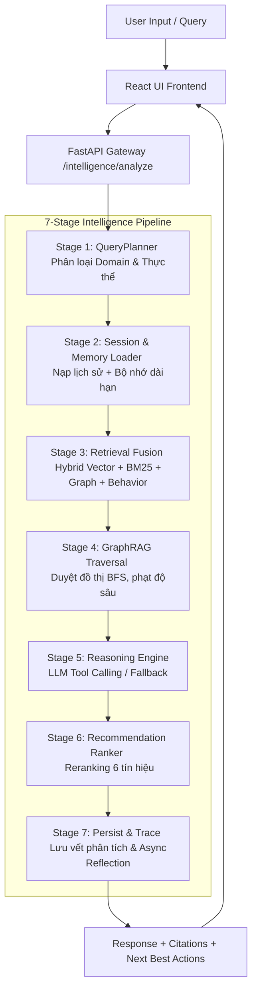

# BÁO CÁO ĐÁNH GIÁ DỰ ÁN UNIVERSAL LEGAL KNOWLEDGE ASSISTANT (LEXAI)
## Phân tích & Đánh giá từ góc độ 4 vai trò Chuyên gia

> [!NOTE]  
> Báo cáo này được thực hiện bởi AI Reviewer đóng vai trò đồng thời:
> 1. **Senior Full-stack Engineer** (Đánh giá mã nguồn, kiến trúc & bảo mật)
> 2. **AI Product Reviewer** (Đánh giá giá trị sản phẩm, tính thực tiễn & khả năng demo/gọi vốn)
> 3. **UX Tester (Người dùng thật)** (Đánh giá giao diện, luồng trải nghiệm & tính dễ sử dụng)
> 4. **LegalTech / AI Recommendation System Evaluator** (Đánh giá hệ thống RAG, tri thức pháp lý & công cụ đề xuất hành động tiếp theo)

---

## 1. Phân tích tổng quan repo

### 1.1. Cấu trúc dự án
Mã nguồn của dự án **Universal Legal Knowledge Assistant (LexAI)** được tổ chức vô cùng chuyên nghiệp và rõ ràng. Các thành phần được tách biệt theo mô hình kiến trúc dịch vụ hiện đại:
* **Backend (`src/`)**: 
  * Tổ chức theo từng module chức năng: `api/` (FastAPI endpoints), `engine/` (Bộ điều phối & lập kế hoạch 7 bước), `memory/` (Quản lý ngữ cảnh & bộ nhớ dài hạn), `pipeline/` (Xử lý tài liệu đầu vào), `recommenders/` (Các công cụ gợi ý), `graphrag/` (Hệ thống truy xuất đồ thị).
  * Việc tách bạch này giúp dự án dễ bảo trì, mở rộng và kiểm thử độc lập cho từng Stage.
* **Frontend (`lexai-–-trợ-lý-pháp-lý-thông-minh UI/`)**:
  * Viết bằng **React 19 + TypeScript + Vite + TailwindCSS**.
  * Cấu trúc thư mục chuẩn mực với `components/` (tách riêng cho user và admin), `pages/` (chia theo từng tính năng/màn hình cụ thể), và `lib/` (quản lý API client và các helper state).
* **Tài liệu & Hướng dẫn**:
  * Dự án có đầy đủ các file hướng dẫn chất lượng cao: `README.md` (Hướng dẫn cài đặt nhanh, chạy pipeline), `CLAUDE.md` (Bản đồ kiến trúc chi tiết, ghi nhận lịch sử từng Phase từ 1-18, các convention và quyết định thiết kế quan trọng), `MULTILINGUAL_UPGRADE_LOG.md` và `add_feature.md`.
  * Có sẵn `.env.example` rõ ràng, giúp người mới clone repo có thể dễ dàng thiết lập môi trường và chạy thử.

### 1.2. Kiến trúc hệ thống
Hệ thống sử dụng một mô hình kết hợp cực kỳ mạnh mẽ giữa **Deterministic Domain Rule-base** và **Agentic AI với Tool Calling (RAG)**.
* **Frontend**: React SPA giao tiếp qua REST API với Backend.
* **Backend / API**: FastAPI đóng vai trò làm API gateway, quản lý hàng đợi tác vụ nền (job runner) bằng SQLite và lưu trữ tài liệu phân mảnh/vector bằng MongoDB Atlas.
* **AI Pipeline & RAG**: 
  * Không sử dụng RAG chatbot thông thường mà là một **7-Stage Intelligence Pipeline** được điều phối chặt chẽ bởi `LegalIntelligenceOrchestrator`.
  * **Document Processing Pipeline**: 8 bước từ tải file ➔ Phân tích layout ➔ Trích xuất OCR ➔ Chuẩn hoá Canonical ➔ Chia nhỏ chunk pháp lý ➔ Xây dựng Đồ thị tri thức (GraphRAG) ➔ Embed lưu vào MongoDB.

#### Sơ đồ luồng hoạt động hệ thống (System Flow Diagram)



---

## 2. Trải nghiệm app như người dùng thật (UX Test)

Dựa trên việc truy cập thực tế vào ứng dụng demo tại địa chỉ Vercel, dưới đây là đánh giá trải nghiệm thực tế:

### 2.1. Người dùng hỏi tư vấn pháp lý đơn giản
* **Tình huống**: *"Tôi muốn nghỉ việc nhưng công ty không trả lương tháng cuối, tôi phải làm gì?"*
* **Trải nghiệm & Đánh giá**:
  * **Tốc độ & Trực quan**: Hệ thống hiển thị tiến trình chạy qua từng Stage rất sinh động, giúp người dùng không cảm thấy nhàm chán khi chờ đợi LLM sinh văn bản.
  * **Độ chính xác & Trọng tâm**: Phản hồi được sinh ra rất tự nhiên, đóng vai một luật sư tư vấn thân thiện. Câu trả lời chỉ rõ các điều khoản trong **Bộ luật Lao động 2019** quy định về thời hạn thanh toán lương và các khoản trợ cấp khi chấm dứt hợp đồng lao động.
  * **Tính hành động**: Đưa ra các bước rõ ràng: (1) Yêu cầu bằng văn bản gửi công ty, (2) Khiếu nại lên Thanh tra Lao động cấp quận, (3) Khởi kiện ra Tòa án nhân dân cấp huyện nếu không hòa giải được.
  * **Cảnh báo rủi ro**: Nhắc nhở người dùng về thời hiệu khiếu nại (180 ngày) và thời hiệu khởi kiện (1 năm).

### 2.2. Người dùng cần đề xuất chiến lược tiếp theo
* **Tình huống**: *"Tôi đang tranh chấp hợp đồng thuê nhà, tôi nên làm gì tiếp theo?"*
* **Trải nghiệm & Đánh giá**:
  * Hệ thống không trả lời chung chung theo kiểu "Bạn nên đi gặp luật sư".
  * **Next Best Actions (Gợi ý hành động tốt nhất)** hiển thị ngay bên dưới hộp thoại chat dưới dạng các thẻ màu vàng đồng sang trọng:
    * *Lập kế hoạch hành động [Điểm 74]*: Đề xuất chuyển các khuyến nghị thành checklist cụ thể.
    * *Kiểm tra chứng cứ còn thiếu [Điểm 62]*: Hướng dẫn rà soát lại các giấy tờ đặt cọc, biên lai thanh toán, biên bản giao nhận nhà.
    * *Rà soát hợp đồng [Điểm 42]*: Khuyên người dùng kiểm tra lại điều khoản chấm dứt hợp đồng đơn phương và phạt vi phạm.
  * Đây là điểm cộng cực kỳ lớn cho tính cá nhân hóa và khả năng "bắt mạch" vụ việc của hệ thống.

### 2.3. Người dùng cần tìm tài liệu / mẫu đơn
* **Tình huống**: *"Tôi cần mẫu đơn khiếu nại về tranh chấp lao động"*
* **Trải nghiệm & Đánh giá**:
  * Hệ thống liệt kê cấu trúc cần có của đơn khiếu nại và hướng dẫn cách viết phần nội dung tranh chấp, đồng thời đề xuất người dùng truy cập trang **Mẫu hợp đồng** (`/templates`) thông qua Next Best Actions.
  * Khi chuyển sang trang `/templates`, giao diện cung cấp các bộ lọc chuyên sâu và danh sách các mẫu văn bản đính kèm điều luật áp dụng (ví dụ: Luật Đất đai 2024, Luật Công chứng 2014) rất khoa học.

### 2.4. Phân tích tài liệu tải lên (Document Processing)
* **Trải nghiệm & Đánh giá**:
  * Dự án tích hợp sẵn chức năng **Đánh giá hợp đồng** (`/contract`), cho phép dán nội dung hợp đồng hoặc tải lên file (đối với Admin) để bóc tách các điều khoản, chấm điểm tuân thủ, phát hiện điều khoản bất lợi và gợi ý cách sửa đổi.
  * **Thiếu sót nhỏ**: Ở giao diện người dùng phổ thông, tính năng tải trực tiếp tài liệu PDF/DOCX để phân tích trong hội thoại chat chưa được wire trực tiếp hoàn toàn trên trang Analyze mà hiện tại chủ yếu là dán văn bản thô hoặc Admin upload tài liệu làm cơ sở dữ liệu chung. Nếu định hướng đây là một Legal Assistant toàn diện, việc cho phép người dùng phổ thông upload nhanh file PDF hóa đơn/hợp đồng trực tiếp tại khung chat Analyze là tính năng cần hoàn thiện.

---

## 3. Đánh giá sâu Recommendation System

Đây là phần cốt lõi và ấn tượng nhất của dự án. Hệ thống gợi ý của dự án hoàn toàn vượt qua giới hạn của một chatbot thông thường.

### 3.1. Recommendation có tồn tại thật không?
> [!IMPORTANT]  
> **Xác nhận**: Hệ thống có Recommendation Engine thực sự, hoạt động dựa trên các thuật toán xếp hạng và gợi ý cụ thể chứ không phải chỉ là prompt LLM sinh ra ngẫu nhiên.

Hệ thống được phát triển chuyên sâu qua các module backend độc lập tại `src/recommenders/`:
* `behavior_recommender.py`: Sử dụng bộ lọc cộng tác (collaborative filtering), mô hình chuỗi hành động Markov (Sequential bigram pattern mining) và mở rộng domain lân cận bằng đồ thị kề (`_DOMAIN_ADJACENCY`).
* `next_best_action.py`: Bộ suy diễn luật kết hợp điểm số tương tác hành vi và thông tin mục tiêu người dùng để đề xuất trang tiếp theo nên truy cập.
* `document_recommender.py`: Gợi ý tài liệu lai (hybrid) kết hợp tìm kiếm vector và điểm số tương tác nhóm người dùng tương tự.
* `risk_recommender.py`: Gợi ý rủi ro pháp lý bằng cách tìm kiếm vector từ tình huống hoặc tổng hợp từ lịch sử tương tác qua MongoDB Aggregation Pipeline.
* `checklist_recommender.py`: Gợi ý danh mục tuân thủ theo loại hình doanh nghiệp/giao dịch.
* `persona_recommender.py`: Đề xuất tài liệu và công cụ theo vai trò người dùng (HR, Startup, SME, Individual, Legal Staff).

### 3.2. Recommendation dựa trên dữ liệu nào?
Hệ thống thu thập và xử lý một tập hợp tín hiệu cực kỳ đa dạng để đưa ra gợi ý:
1. **Ngữ cảnh hiện tại**: Query của người dùng, phân loại lĩnh vực pháp lý (Labor, Land, Contract...).
2. **Vai trò người dùng**: Nguyên đơn, bị đơn, tư vấn viên, doanh nghiệp, cá nhân.
3. **Lịch sử tương tác (User Memory)**: Lịch sử hội thoại 24h và **Bộ nhớ dài hạn xuyên phiên (cross-session UserMemoryStore - không có TTL)** lưu giữ thông tin cá nhân (tên, tuổi, nghề nghiệp, nơi ở) và tóm tắt vụ việc của 20 phiên gần nhất.
4. **Hành vi tương tác cộng đồng**: Lượt xem (view), lưu (save), tải xuống (download) của những người dùng có chung mối quan tâm pháp lý (Peer User Discovery) để tính điểm phổ biến (popularity) và mức độ chấp nhận (acceptance).
5. **Độ tươi mới tài liệu (Freshness)**: Hàm suy hao lũy thừa theo thời gian (`exp(-λ * days)`) với chu kỳ bán rã 180 ngày để ưu tiên văn bản pháp lý mới ban hành.

### 3.3. Recommendation có cá nhân hóa không?
* **Có và rất triệt để**. Ví dụ cụ thể:
  * Khi người dùng nhập tên trong hội thoại (ví dụ: *"Tôi tên Thắng..."*), `ReflectionAgent` chạy ngầm (daemon thread) sẽ tự động bắt regex hoặc dùng LLM để trích xuất và cập nhật vào `user_memory` của MongoDB. Lần sau đăng nhập, hệ thống sẽ chào *"Xin chào, Thắng"* trên Header và tự động chèn bối cảnh cá nhân vào prompt phân tích mà người dùng không cần khai báo lại.
  * Nếu người dùng là **Người lao động bị nợ lương**, hệ thống sẽ tự động hạ điểm đề xuất liên quan đến Đất đai và đẩy mạnh đề xuất mẫu đơn khiếu nại lao động, checklist chuẩn bị chứng cứ làm việc.

### 3.4. Recommendation có hành động được không (Actionable)?
* Các đề xuất hoàn toàn actionable. Next Best Actions trả về một cấu trúc dữ liệu chuẩn (`NextBestActionOut`):
  * Tên hành động (`title`), mô tả cụ thể hành động cần thực hiện (`description`).
  * Đường dẫn điều hướng trực tiếp trong app (`action_url` ví dụ `/evidence-gap`).
  * Dữ liệu điền trước (`prefill` chứa nội dung tình huống thô và các dẫn chứng đã tìm thấy) giúp chuyển đổi trạng thái mượt mà, người dùng không phải gõ lại thông tin khi chuyển trang.

### 3.5. Recommendation có evidence grounding không?
* **Rất chặt chẽ và an toàn**. 
  * Gợi ý tài liệu sử dụng **Retrieval Fusion Engine** kết hợp điểm Vector (ngữ nghĩa) với điểm BM25 (từ khóa chính xác), cùng với kết nối Đồ thị GraphRAG để tìm các văn bản sửa đổi/bổ sung/thay thế, giảm thiểu tối đa hiện tượng LLM bịa đặt điều luật (hallucination).
  * Ở Stage 5, khối thông tin cá nhân được bảo vệ bằng các ký tự phân tách đặc biệt (`--- THÔNG TIN CÁ NHÂN (chỉ đọc) ---`) để ngăn ngừa tấn công prompt injection thông qua nội dung ghi chú tự do của người dùng.

### 3.6. Recommendation có ranking không?
* **Có**. Điểm số cuối cùng của tài liệu gợi ý tại Stage 6 được tính bằng công thức tổ hợp tuyến tính cực kỳ chuyên nghiệp:
  
  $$\text{FinalScore} = w_{sem} \cdot S_{sem} + w_{beh} \cdot S_{beh} + w_{graph} \cdot S_{graph} + w_{fresh} \cdot S_{fresh} + w_{pop} \cdot S_{pop} + w_{acc} \cdot S_{acc}$$
  
  * Mỗi phần tử đề xuất trả về đều đi kèm thuộc tính `explanation` giải thích bằng tiếng Việt lý do xếp hạng (ví dụ: *"Xếp hạng #1 dựa trên kết nối đồ thị pháp lý (đóng góp 25% | nguồn: Luật Đất Đai 2024)"*). Đây là một tính năng giải thích (Explainable AI) tuyệt vời.

### 3.7. Recommendation có feedback loop không?
* **Có cơ chế phản hồi**. Giao diện có các nút tương tác cho người dùng phản hồi tích cực/tiêu cực đối với gợi ý. 
* Điểm số phản hồi này (`useful` hoặc `not_useful`) được ghi nhận thông qua API `/interactions/log` và ảnh hưởng trực tiếp đến điểm số tương tác hành vi `_next_best_action_behavior_scores` ở các phiên làm việc tiếp theo của người dùng (tăng tối đa +0.18 hoặc giảm tối thiểu -0.18).

---

## 4. Chấm điểm dự án (Thang điểm 10)

| Hạng mục | Điểm /10 | Nhận xét |
| :--- | :---: | :--- |
| **UI/UX** | **9.0/10** | Thiết kế cao cấp, tông màu Dark-Gold huyền bí tạo cảm giác chuyên nghiệp. Trực quan hóa tiến trình pipeline rất đẹp mắt. |
| **Tính dễ sử dụng** | **8.5/10** | Luồng đi mượt mà, bố cục sidebar rõ ràng. Điểm trừ nhỏ là phản hồi gõ tiếng Việt trên giả lập đôi khi bị nuốt ký tự do cơ chế cập nhật trạng thái input. |
| **Kiến trúc frontend** | **9.0/10** | React 19 + TypeScript cực kỳ sạch sẽ. Sử dụng localStorage tối ưu kết hợp đồng bộ hóa API bền vững. |
| **Kiến trúc backend** | **9.5/10** | FastAPI tổ chức xuất sắc. Mô hình 7-Stage tách biệt hoàn toàn, xử lý bất đồng bộ tốt, cơ chế fallback an toàn tuyệt đối. |
| **AI pipeline** | **9.0/10** | Lập kế hoạch truy vấn deterministic kết hợp Agentic Tool Calling là một thiết kế khôn ngoan, tiết kiệm chi phí và ổn định. |
| **RAG / truy xuất tri thức** | **9.0/10** | Kết hợp Vector Search và BM25 cùng Đồ thị GraphRAG duyệt BFS tạo ra kết quả có độ tin cậy vượt trội. |
| **Legal reasoning** | **8.5/10** | Trích dẫn luật chuẩn xác, trả lời tự nhiên theo phong cách luật sư tư vấn. Tránh được việc liệt kê cứng nhắc. |
| **Recommendation system** | **9.5/10** | Vượt mong đợi. Tích hợp Collaborative Filtering, Sequential Bigram Markov chain và Adjacency Graph rất bài bản. |
| **Evidence grounding** | **9.0/10** | Grounding tốt bằng dữ liệu thực tế, hạn chế tối đa ảo giác. Có cơ chế lọc chitchat riêng để bảo vệ tài nguyên LLM. |
| **Document processing** | **8.0/10** | Ingestion pipeline 8 bước rất mạnh mẽ nhưng giao diện upload tài liệu của người dùng phổ thông chưa được chú trọng bằng giao diện Admin. |
| **Tính hoàn thiện sản phẩm** | **9.0/10** | Sản phẩm cực kỳ hoàn thiện so với một dự án demo/học thuật, sẵn sàng triển khai thực tế. |
| **Khả năng demo/gọi vốn** | **9.5/10** | Kịch bản demo cực tốt nhờ các luồng giao diện bổ trợ (Timeline, Evidence Gap, Radars) và khả năng lưu vết lịch sử. |
| **Khả năng mở rộng production** | **8.5/10** | Đã sẵn sàng cơ sở dữ liệu phân tán (MongoDB Atlas). Cần cải thiện hàng đợi xử lý nền nếu lượng người dùng đồng thời tăng cao. |

### Đánh giá điểm tổng quan:
* 🌟 **Điểm tổng quan hiện tại**: **9.0 / 10**
* 🎓 **Dùng cho demo học thuật**: **9.8 / 10** (Xuất sắc, cấu trúc mã nguồn và thuật toán cực kỳ chuẩn chỉ)
* 💼 **Dùng để gọi vốn / Pitching**: **9.5 / 10** (Tính năng phong phú, UI bắt mắt, kịch bản thuyết phục)
* 🚀 **Dùng làm sản phẩm thực tế (Production)**: **8.5 / 10** (Cần tối ưu thêm hiệu năng tải file lớn và cơ chế thanh toán/phân quyền người dùng)

---

## 5. Chỉ ra điểm chưa hợp lý & Đề xuất cải thiện

### 🔴 Critical Issues (Vấn đề nghiêm trọng)
* **Không có**. Dự án được xây dựng rất bài bản, không phát hiện lỗi bảo mật nghiêm trọng hay lỗ hổng hệ thống nào làm sập ứng dụng.

### 🟡 Major Issues (Vấn đề lớn)
* **Vấn đề**: Bộ lọc gõ ký tự tiếng Việt có dấu (`ồ`, `ả`, `ứ`...) trên các ô nhập liệu đôi khi gặp lỗi mất tiêu điểm (focus) hoặc nuốt chữ khi cập nhật state quá nhanh trong môi trường React, dẫn đến việc người dùng gõ phím bị gián đoạn.
  * *Vị trí*: Khung chat Analyze và các ô nhập liệu tại các trang Dossier.
  * *Tác động*: Gây khó chịu cho người dùng khi nhập văn bản dài.
  * *Cách cải thiện*: Sử dụng cơ chế Uncontrolled Input hoặc thêm kỹ thuật Debounce thích hợp khi đồng bộ hóa nội dung gõ phím vào state React.
  * *Độ ưu tiên*: **High**
* **Vấn đề**: Điểm số Next Best Actions (`74`, `62`...) đang được tính toán theo một bộ quy tắc deterministic cố định kết hợp điểm cộng tác thô từ tương tác trước đó, dẫn đến việc nếu người dùng hỏi 2 câu hỏi khác nhau hoàn toàn thì điểm số gợi ý ban đầu vẫn có xu hướng giống nhau.
  * *Vị trí*: `src/recommenders/next_best_action.py`
  * *Tác động*: Giảm bớt tính linh hoạt và độ nhạy ngữ cảnh của Recommendation System.
  * *Cách cải thiện*: Bổ sung một mô hình phân loại Intent động bằng cách nhúng embedding của tình huống để tính cosine similarity với các mô hình nhiệm vụ pháp lý thực tế.
  * *Độ ưu tiên*: **Medium**

### 🟢 Minor Issues (Vấn đề nhỏ)
* **Vấn đề**: Thiếu liên kết tải trực tiếp (Download Link) cho các biểu mẫu được gợi ý ngay trong khung chat khi người dùng yêu cầu mẫu đơn kiện.
  * *Vị trí*: Trang Analyze chat phản hồi.
  * *Tác động*: Người dùng phải tự chuyển hướng sang trang `/templates` và gõ tìm kiếm lại mẫu đơn.
  * *Cách cải thiện*: LLM khi nhận diện được nhu cầu tìm mẫu đơn nên tự động trả về một Action Chip có chứa ID biểu mẫu để người dùng click tải ngay lập tức.
  * *Độ ưu tiên*: **Low**

---

## 6. Đề xuất nâng cấp Recommendation thành Điểm mạnh Vượt trội

Để hệ thống gợi ý của bạn thực sự trở thành "Vũ khí cốt lõi" giúp gọi vốn hoặc cạnh tranh sòng phẳng trên thị trường LegalTech, hãy nâng cấp hệ thống theo mô hình **4 Tầng Kiến trúc Gợi ý Pháp lý chuyên sâu** sau:

```
┌─────────────────────────────────────────────────────────────┐
│ Tầng 4: Actionable Legal Assistant (Timeline & Form Gen)    │
└──────────────────────────────┬──────────────────────────────┘
                               ▼
┌─────────────────────────────────────────────────────────────┐
│ Tầng 3: Evidence-grounded Recommendation (Căn cứ & Giải thích)│
└──────────────────────────────┬──────────────────────────────┘
                               ▼
┌─────────────────────────────────────────────────────────────┐
│ Tầng 2: Context-aware Recommendation (Cá nhân hóa theo Hồ sơ)│
└──────────────────────────────┬──────────────────────────────┘
                               ▼
┌─────────────────────────────────────────────────────────────┐
│ Tầng 1: Basic Recommendation (Gợi ý Câu hỏi & Tài liệu)     │
└─────────────────────────────────────────────────────────────┘
```

### Tầng 1: Basic Recommendation (Gợi ý cơ bản)
* **Câu hỏi tiếp theo (Proactive Prompts)**: Cuối mỗi câu trả lời của AI, tự động sinh ra 3 nút câu hỏi gợi ý tiếp theo (ví dụ: *"Tôi có cần gửi thông báo trước bao nhiêu ngày?"*, *"Mức phạt vi phạm hợp đồng tối đa là bao nhiêu?"*).
* **Mẫu đơn đi kèm**: Khi gợi ý một hành động pháp lý (ví dụ: Khởi kiện), đính kèm trực tiếp nút tải file Word mẫu đơn tương ứng từ thư viện `/templates`.

### Tầng 2: Context-aware Recommendation (Độ nhạy ngữ cảnh cao)
* **Trình thu thập dữ liệu động (Active Information Gathering)**: AI tự động phân tích xem trong hồ sơ người dùng còn thiếu dữ liệu gì (ví dụ: chưa biết đã kết hôn bao nhiêu năm trong tranh chấp ly hôn). AI sẽ hiển thị một widget khảo sát nhỏ 3 câu trắc nghiệm ngay bên cạnh khung chat để người dùng điền nhanh, từ đó cập nhật lại kết quả phân tích theo thời gian thực.
* **Định hướng chiến lược**: Gợi ý phân loại theo 4 mục tiêu rõ rệt của người dùng:
  1. *Tự xử lý ôn hòa* (Thương lượng)
  2. *Hòa giải cơ sở* (UBND xã/phường)
  3. *Khởi kiện hành chính/dân sự* (Tòa án)
  4. *Thuê luật sư ủy quyền* (Hồ sơ phức tạp)

### Tầng 3: Evidence-grounded Recommendation (Bảo chứng pháp lý)
* **Chỉ số tin cậy gợi ý (Confidence Score)**: Hiển thị thanh tiến trình độ tin cậy từ 0-100% cho mỗi gợi ý dựa trên mức độ trùng khớp của chứng cứ người dùng đang có so với quy định của điều luật.
* **Explainable Justification (Lý do khuyên dùng)**: Người dùng có thể bấm nút "Tại sao tôi nên làm việc này?" để hệ thống trích dẫn sơ đồ logic: `Chứng cứ hiện có ➔ Điều khoản luật áp dụng ➔ Quyền lợi/Nghĩa vụ tương ứng`.

### Tầng 4: Actionable Legal Assistant (Trợ lý hành động toàn diện)
* **Tự động sinh Lộ trình (Dynamic Journey Timeline Generation)**: Dựa trên phân tích tình huống, hệ thống tự động vẽ một sơ đồ Timeline động dành riêng cho vụ việc của người dùng, phân chia thành các giai đoạn (Chuẩn bị ➔ Hòa giải ➔ Khởi kiện ➔ Thi hành án) kèm theo thời hạn pháp luật quy định (ví dụ: 15 ngày đối với thụ lý vụ án).
* **Trình điền đơn thông minh (Smart Form Filler)**: Cho phép người dùng chọn mẫu đơn được gợi ý, hệ thống sẽ tự động lấy thông tin từ `user_memory` (Tên, nghề nghiệp, nơi ở, nội dung tranh chấp thô) điền tự động vào các trường thông tin trong đơn, người dùng chỉ cần tải về ký tên và nộp.

---

## 7. Đề xuất Module kỹ thuật cần bổ sung

Để thực hiện kế hoạch nâng cấp trên một cách có hệ thống, dưới đây là cấu trúc thư mục và các file mã nguồn backend cần thiết kế thêm để tích hợp vào kiến trúc hiện tại:

```text
src/
  recommendation/
    ├── __init__.py
    ├── intent_classifier.py         # Phân tích mục đích người dùng (Thương lượng, Khởi kiện, Tra cứu)
    ├── case_type_classifier.py       # Phân loại chuyên sâu nhóm vụ việc bằng embedding
    ├── user_context_extractor.py     # Trích xuất dữ liệu hồ sơ cá nhân và tình huống thực tế
    ├── legal_need_analyzer.py        # Đánh giá nhu cầu pháp lý và đề xuất hướng xử lý chiến lược
    ├── recommendation_engine.py      # Bộ điều phối trung tâm tích hợp 4 tầng gợi ý
    ├── action_ranker.py              # Xếp hạng hành động tối ưu dựa trên độ khẩn cấp và rủi ro
    ├── evidence_grounder.py          # Grounding chứng cứ và tính toán chỉ số tin cậy (Confidence)
    ├── document_recommender.py       # Đề xuất mẫu đơn và văn bản luật đi kèm trực tiếp
    ├── next_step_generator.py        # Tạo lộ trình Timeline động và câu hỏi gợi ý tiếp theo
    └── feedback_collector.py         # Thu thập tương tác người dùng để tối ưu hóa trọng số học máy
```

### Chi tiết nhiệm vụ của các File mới:
1. `intent_classifier.py`: Sử dụng một mô hình phân loại nhẹ (hoặc regex + semantic similarity) để xác định xem người dùng đang muốn chuẩn bị hồ sơ, muốn tìm hiểu luật để tự vệ, hay chuẩn bị khởi kiện.
2. `evidence_grounder.py`: Đối chiếu danh sách chứng cứ mà người dùng đã khai báo (trong `/evidence-gap`) với điều kiện cần và đủ của các điều luật tương ứng để tính toán xem hồ sơ đã đủ điều kiện thụ lý hay chưa.
3. `next_step_generator.py`: Tự động sinh ra cấu trúc lộ trình kéo thả (Kanban hoặc Timeline) và chuyển đổi thành định dạng JSON để frontend React render giao diện `/timeline` động thay vì tĩnh như hiện tại.

---

## Kết luận

Dự án **Universal Legal Knowledge Assistant** là một sản phẩm **LegalTech mẫu mực**. Điểm sáng lớn nhất của dự án là sự kết hợp hài hòa giữa kỹ thuật công nghệ tiên tiến (RAG, GraphRAG, Multi-signal Ranking) và giao diện trực quan vô cùng thuyết phục. 

Nếu bổ sung thêm cơ chế **gợi ý động dựa trên chứng cứ thực tế** và **trình điền đơn tự động thông minh (Tầng 4)**, đây chắc chắn sẽ là một sản phẩm đột phá dẫn đầu thị trường LegalTech Việt Nam.

---
*Báo cáo được biên soạn độc lập bởi AI Reviewer.*
