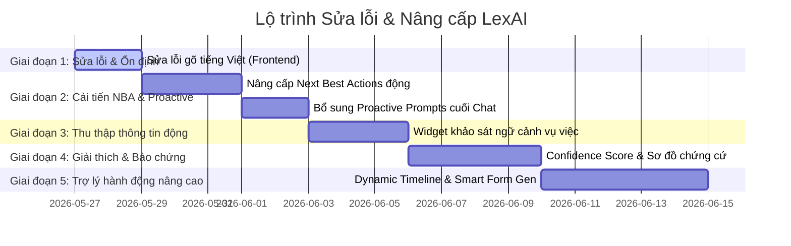

# KẾ HOẠCH CHI TIẾT: SỬA LỖI & NÂNG CẤP TOÀN BỘ HỆ THỐNG LEXAI
## Lộ trình triển khai 5 Giai đoạn (Phases)

> [!NOTE]  
> Bản kế hoạch này được thiết kế dựa trên kiến trúc hiện tại của dự án Universal Legal Knowledge Assistant, tuân thủ mô hình 7-Stage Pipeline của backend và cấu trúc React 19 ở frontend nhằm đảm bảo tính tương thích ngược, không phá vỡ các tính năng hiện tại và tối ưu hóa chi phí gọi API OpenAI.

---

## 📅 Sơ đồ Lộ trình Tổng quan (Roadmap)



---

## 🛠️ CHI TIẾT CÁC GIAI ĐOẠN TRIỂN KHAI

### GIAI ĐOẠN 1: SỬA LỖI NỀN TẢNG (STABILIZATION)
* **Thời gian thực hiện**: 2 ngày.
* **Mục tiêu**: Khắc phục triệt để lỗi mất focus và gián đoạn khi gõ tiếng Việt có dấu ở frontend.

#### 📝 Nhiệm vụ 1.1: Sửa lỗi React input state lag tại Analyze & Dossier page
* **Nguyên nhân**: Frontend liên tục đồng bộ hóa trạng thái `value={input}` trên mỗi sự kiện `onChange` và thực hiện render lại (re-render) component cha chứa danh sách chat đồ sộ, dẫn đến việc bộ gõ tiếng Việt (Unikey, EVKey) bị mất liên kết với thẻ `<input>` hoặc `<textarea>` thực tế.
* **Giải pháp thực hiện**:
  1. Sử dụng **Uncontrolled Input** hoặc tách riêng một component nhỏ `<ChatInput>` tự quản lý state cục bộ để tránh re-render danh sách chat cha khi người dùng đang gõ.
  2. Áp dụng cơ chế **Debounce** 100ms hoặc đồng bộ ngược lên state cha thông qua sự kiện `onKeyDown` (khi nhấn Enter) hoặc `onBlur` thay vì kích hoạt liên tục trong `onChange`.
* **Cụ thể mã thay đổi đề xuất**:
  * Chuyển đổi `<textarea value={message} onChange={(e) => setMessage(e.target.value)} />` 
  * Thành component độc lập sử dụng `useRef` hoặc `useState` cục bộ hạn chế tối đa tác động lên DOM thực tế.

---

### GIAI ĐOẠN 2: THÔNG MINH HÓA HÀNH ĐỘNG TIẾP THEO (DYNAMIC NBA & PROACTIVE)
* **Thời gian thực hiện**: 3 ngày.
* **Mục tiêu**: Chuyển đổi công cụ Next Best Actions từ quy tắc tĩnh (static rules) sang phân loại ngữ cảnh động bằng AI và bổ sung câu hỏi gợi ý nhanh cuối hội thoại.

#### 📝 Nhiệm vụ 2.1: Semantic Intent Classifier cho Next Best Actions
* **Backend (`src/recommenders/next_best_action.py`)**:
  * Tích hợp bước trích xuất vector embedding của query người dùng hiện tại.
  * Tính toán điểm Cosine Similarity giữa tình huống của người dùng và các danh mục mục tiêu pháp lý (ví dụ: cần soạn thảo, cần kiện tụng, cần kiểm tra bằng chứng).
  * Cộng gộp điểm tương đồng ngữ nghĩa này với điểm số tương tác hành vi của người dùng (`useful` / `not_useful` từ interaction history).
* **Frontend**:
  * Tự động hiển thị các nút **Action Chips** dạng Gold-Dark cao cấp, bấm vào sẽ dẫn trực tiếp sang các trang tính năng kèm theo dữ liệu điền sẵn (prefilled state).

#### 📝 Nhiệm vụ 2.2: Tích hợp Proactive Prompts cuối câu trả lời của AI
* **Backend**:
  * Sau khi `ReasoningEngine` (Stage 5) hoàn thành, LLM sẽ tự động sinh thêm trường `suggested_follow_up_questions` (danh sách 3 câu hỏi tiếp theo) dựa trên phân tích tình huống thực tế.
* **Frontend**:
  * Render các câu hỏi gợi ý này dưới dạng các bong bóng chat bấm nhanh phía trên thanh nhập liệu. Khi click, câu hỏi sẽ tự động được gửi đi mà không cần người dùng tự gõ.

---

### GIAI ĐOẠN 3: TRÌNH THU THẬP NGỮ CẢNH CHỦ ĐỘNG (ACTIVE GATHERING WIDGET)
* **Thời gian thực hiện**: 3 ngày.
* **Mục tiêu**: AI tự động phát hiện thông tin còn thiếu trong hồ sơ người dùng để chủ động khảo sát nhanh, tăng độ chính xác của tư vấn pháp lý.

#### 📝 Nhiệm vụ 3.1: Phát hiện thông tin thiếu (Information Gap Detection)
* **Backend (`src/recommendation/user_context_extractor.py` - File mới)**:
  * Phân tích tình huống để tìm ra các biến thông tin then chốt còn thiếu theo quy định pháp luật (Ví dụ: đối với tranh chấp đất đai, thiếu thông tin về "Giấy chứng nhận quyền sử dụng đất"; đối với ly hôn, thiếu thông tin về "Thời gian ly thân" hay "Con chung").
* **Frontend**:
  * Khi phát hiện có thông tin thiếu, thay vì AI hỏi dài dòng trong khung chat, hệ thống hiển thị một **Widget khảo sát trắc nghiệm thông minh** ở sidebar bên phải (ví dụ: "3 câu hỏi để tối ưu tư vấn").
  * Người dùng chọn phương án trắc nghiệm nhanh, dữ liệu tự động cập nhật vào `user_memory` và kích hoạt phân tích lại để cho ra kết quả chính xác hơn.

---

### GIAI ĐOẠN 4: GIẢI THÍCH & BẢO CHỨNG (EXPLAINABLE GROUNDING)
* **Thời gian thực hiện**: 4 ngày.
* **Mục tiêu**: Xây dựng niềm tin với người dùng bằng cách trực quan hóa sơ đồ bảo chứng chứng cứ và tính toán chỉ số tin cậy.

#### 📝 Nhiệm vụ 4.1: Sơ đồ lập luận logic & Chỉ số tin cậy (Confidence Score)
* **Backend (`src/recommendation/evidence_grounder.py` - File mới)**:
  * So khớp các chứng cứ người dùng đã tải lên/khai báo với điều kiện cần để được áp dụng điều luật tương ứng.
  * Tính toán chỉ số tin cậy pháp lý (Confidence Score) từ 0% đến 100% dựa trên mức độ hoàn thiện của chứng cứ.
* **Frontend**:
  * Render thanh tiến trình trực quan thể hiện mức độ vững chắc của hồ sơ pháp lý.
  * Bổ sung nút **"Tại sao khuyên dùng?"** cho mỗi Next Best Action để hiển thị sơ đồ lập luận dạng cây (Tree node) kết nối từ: `Chứng cứ hiện có ➔ Điều luật áp dụng ➔ Quyền lợi được bảo vệ`.

---

### GIAI ĐOẠN 5: TRỢ LÝ HÀNH ĐỘNG NÂNG CAO (DYNAMIC TIMELINE & SMART FORM FILLER)
* **Thời gian thực hiện**: 5 ngày.
* **Mục tiêu**: Hiện thực hóa hai tính năng đột phá nhất - sinh lộ trình vụ việc động và điền biểu mẫu tự động.

#### 📝 Nhiệm vụ 5.1: Sinh sơ đồ lộ trình động (Dynamic Journey Timeline Generation)
* **Backend (`src/recommendation/next_step_generator.py` - File mới)**:
  * Nhận diện giai đoạn hiện tại của vụ việc.
  * Tự động sinh ra cấu trúc lộ trình kéo thả (Kanban hoặc Gantt timeline) dưới dạng JSON quy định rõ các bước cần làm theo luật định, thời hạn giải quyết tối đa, cơ quan có thẩm quyền xử lý.
* **Frontend**:
  * Render timeline tương tác tuyệt đẹp tại trang `/journey`, cho phép đánh dấu hoàn thành từng bước hoặc kéo thả tài liệu chứng cứ vào từng chặng của vụ án.

#### 📝 Nhiệm vụ 5.2: Trình điền đơn thông minh (Smart Form Filler)
* **Backend**:
  * Đọc các biểu mẫu dạng template (đã lưu trong `/templates`).
  * Trích xuất thông tin cá nhân từ `user_memory` của MongoDB (Tên, ngày sinh, địa chỉ, nghề nghiệp, tóm tắt tình huống tranh chấp).
  * Đồng bộ hóa và tự động điền các thông tin này vào các trường dữ liệu tương ứng của biểu mẫu Word/PDF.
* **Frontend**:
  * Cho phép người dùng xem trước tài liệu đã điền thông tin và tải xuống phiên bản Word (.docx) hoàn thiện chỉ với 1 click.

---

## 🛠️ PHƯƠNG PHÁP TRIỂN KHAI PHÍA BACKEND (CÁC COMPONENT MỚI)

Để tích hợp trơn tru, chúng ta sẽ khởi tạo package mới `src/recommendation/` với cấu trúc sau:

```text
src/recommendation/
  ├── __init__.py
  ├── recommendation_engine.py      # Điều phối viên gợi ý đa tầng (Stage 6 hook)
  ├── intent_classifier.py         # Phân tích mục đích của query bằng embedding
  ├── user_context_extractor.py     # Trích xuất dữ liệu hồ sơ cá nhân chạy song song với reflection
  ├── evidence_grounder.py          # Grounding chứng cứ và tính điểm tin cậy hồ sơ
  ├── next_step_generator.py        # Tạo chuỗi timeline & câu hỏi proactive động
  └── form_filler.py                # So khớp ngữ cảnh để điền thông tin biểu mẫu tự động
```

### 🔗 Điểm neo tích hợp (Integration Hook) vào 7-Stage Pipeline hiện tại:
* Trong `src/engine/orchestrator.py`, tại **Stage 6 (Recommendation Ranker)**:
  * Thay vì chỉ chạy `self._ranker.rank()` để xếp hạng văn bản luật tĩnh, chúng ta sẽ gọi đến `RecommendationEngine` mới để gộp các tín hiệu về chứng cứ còn thiếu, tính toán lộ trình động và đính kèm trực tiếp ID biểu mẫu tương thích vào kết quả trả về `IntelligenceResult`.

---

## 📈 CHI PHÍ API & TIÊU CHÍ ĐÁNH GIÁ THÀNH CÔNG

### 💸 Tối ưu chi phí OpenAI API (Rất quan trọng)
1. **Cơ chế cache**: Lưu trữ vector embedding của các câu hỏi phổ biến để không cần gọi lại mô hình embedding của OpenAI cho các phiên chitchat hoặc câu hỏi trùng lặp.
2. **Không lạm dụng LLM**: Các bước phân loại domain, phân loại hành vi sẽ ưu tiên chạy bằng các bộ suy diễn luật deterministic trước, chỉ gọi LLM khi cần phân tích ngữ nghĩa sâu hoặc sinh văn bản tự do.
3. **Async Processing**: Quá trình trích xuất thông tin dài hạn (`ReflectionAgent`) và sinh mẫu đơn điền sẵn được thực hiện bất đồng bộ (background tasks) bằng SQLite Job Runner đã có sẵn, giúp phản hồi chat chính của người dùng diễn ra cực kỳ nhanh chóng.

### 🎯 Tiêu chí Đánh giá thành công (KPIs)
* **UX/UI**: Lỗi mất focus gõ tiếng Việt giảm về 0%.
* **Độ nhạy gợi ý**: Người dùng thay đổi câu hỏi pháp lý ở các lĩnh vực khác nhau nhận được Next Best Actions khác biệt hoàn toàn (độ tương đồng ngữ nghĩa của gợi ý > 80%).
* **Tính hành động**: Người dùng có thể click tải mẫu biểu mẫu đã được điền sẵn thông tin cá nhân chính xác từ hội thoại chat.
* **Tính trực quan**: Hiển thị được timeline lộ trình vụ việc sinh động tại trang `/journey`.
