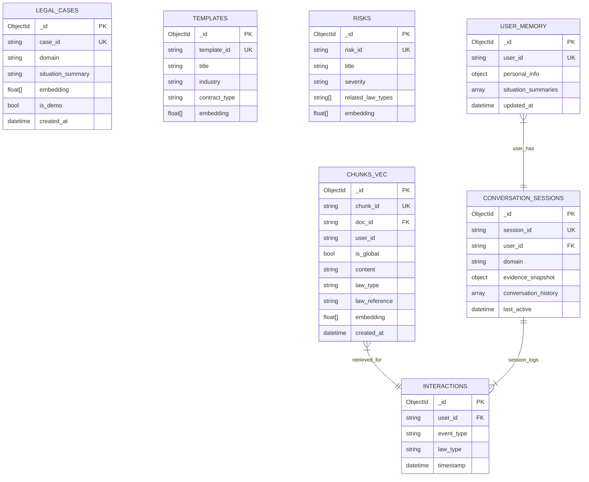

# MongoDB Architecture — LexAI / ULKA

**Database:** `legal_knowledge_assistant` (MongoDB Atlas M0)  
**Driver:** pymongo 4.x  
**Vector dimension:** 384 (sentence-transformers `paraphrase-multilingual-MiniLM-L12-v2`)  
**Similarity metric:** cosine  

---

## Collections Overview

| Collection | Mục đích | Vector Index | TTL |
|---|---|---|---|
| `chunks_vec` | Law chunks với 384-dim embeddings | `chunk_embedding_index` ✅ | — |
| `templates` | Mẫu hợp đồng pre-seeded | `template_embedding_index` ✅ | — |
| `risks` | Legal risk patterns | `risk_embedding_index` ✅ | — |
| `legal_cases` | Similar case descriptions | `case_embedding_index` ❌ Atlas M0 limit | — |
| `contract_clauses` | Contract clause extraction | `clause_embedding_index` ❌ Atlas M0 limit | — |
| `interactions` | User behavior log | — | — |
| `conversation_sessions` | Multi-turn session context | — | **24h TTL** trên `last_active` |
| `user_memory` | Cross-session user memory | — | **Không TTL** |
| `community_case_patterns` | Anonymized community patterns | — | — |
| `user_profiles` | User preference profiles | — | — |

---

## Collection Schemas

### `chunks_vec` — Core Law Chunk Storage

Đây là collection chính, backbone của toàn bộ retrieval pipeline.

```json
{
  "_id": ObjectId,
  "chunk_id": "doc_abc123_chunk_0042",
  "doc_id": "doc_abc123",
  "user_id": "admin",
  "is_global": true,
  "content": "Điều 202 Luật Đất đai 2013 quy định tranh chấp đất đai phải...",
  "law_type": "dat_dai",
  "law_reference": "Điều 202 Luật Đất đai 2013",
  "article_number": "202",
  "law_title": "Luật Đất đai 2013",
  "source_document": "luat_dat_dai_2013.pdf",
  "embedding": [0.0234, -0.1123, 0.0892, ...],
  "metadata": {
    "chunk_index": 42,
    "page": 87,
    "processing_version": "v2.1",
    "confidence": 0.94
  },
  "created_at": "2026-05-28T10:00:00Z"
}
```

**Indexes:**
- Regular: `(chunk_id)` unique, `(doc_id, user_id)`, `(law_type)`, `(is_global)`
- **Vector:** `chunk_embedding_index` — 384-dim cosine `$vectorSearch`

**Data isolation:**
```
is_global = true   → upload bởi admin → visible cho tất cả users
is_global = false  → upload bởi user  → chỉ visible cho user đó
```

Query filter luôn áp dụng:
```javascript
{ $or: [{ user_id: userId }, { is_global: true }] }
```

---

### `templates` — Contract Templates

```json
{
  "_id": ObjectId,
  "template_id": "tmpl_001",
  "title": "Hợp đồng mua bán nhà đất",
  "industry": "bat_dong_san",
  "contract_type": "mua_ban",
  "description": "Mẫu hợp đồng mua bán bất động sản đầy đủ điều khoản...",
  "content": "...",
  "embedding": [0.0234, -0.1123, ...],
  "tags": ["dat_dai", "hop_dong", "bat_dong_san"],
  "created_at": "2026-05-01T00:00:00Z"
}
```

**Vector index:** `template_embedding_index`

---

### `risks` — Legal Risk Patterns

```json
{
  "_id": ObjectId,
  "risk_id": "risk_001",
  "title": "Rủi ro hợp đồng miệng không có chứng cứ",
  "description": "Hợp đồng không văn bản thiếu bằng chứng khi tranh chấp...",
  "severity": "high",
  "related_law_types": ["hop_dong", "dan_su"],
  "embedding": [0.0234, -0.1123, ...],
  "mitigation": "Ký hợp đồng văn bản, công chứng nếu giá trị lớn"
}
```

**Vector index:** `risk_embedding_index`

---

### `legal_cases` — Similar Cases (Hạn chế hiện tại)

```json
{
  "_id": ObjectId,
  "case_id": "case_001",
  "domain": "dat_dai",
  "situation_summary": "Tranh chấp ranh giới đất đai giữa hai hộ liền kề...",
  "outcome": "Tòa án xử chấp nhận yêu cầu nguyên đơn...",
  "key_evidence": ["sổ đỏ", "bản đồ địa chính", "biên bản đo đạc"],
  "applicable_laws": ["Điều 202 Luật Đất đai 2013"],
  "embedding": [0.0234, -0.1123, ...],
  "is_demo": true,
  "created_at": "2026-05-01T00:00:00Z"
}
```

**Hạn chế:** Atlas M0 giới hạn 3 vector search indexes — `case_embedding_index` không thể tạo. Fallback: demo cases với `is_demo=true` được trả về với badge "Ví dụ tham khảo".

---

### `interactions` — User Behavior Log

```json
{
  "_id": ObjectId,
  "user_id": "user_abc123",
  "event_type": "situation_analysis",
  "law_type": "dat_dai",
  "query": "Hàng xóm lấn đất sổ đỏ của tôi",
  "timestamp": "2026-05-30T10:00:00Z",
  "metadata": {
    "session_id": "sess_xyz",
    "domain_confidence": 0.92,
    "response_time_ms": 1240
  }
}
```

**Dùng cho:** Behavior signal (weight 0.10) trong retrieval fusion, behavior recommendations.

---

### `conversation_sessions` — Session Context

```json
{
  "_id": ObjectId,
  "session_id": "sess_abc123",
  "user_id": "user_xyz",
  "domain": "dat_dai",
  "evidence_snapshot": {
    "land_certificate": "PRESENT",
    "ubnd_mediation": "PRESENT_FAILED"
  },
  "conversation_history": [
    {"role": "user", "content": "Tôi đã có sổ đỏ..."},
    {"role": "assistant", "content": "Dựa trên sổ đỏ của bạn..."}
  ],
  "law_type_preferences": ["dat_dai"],
  "last_active": "2026-05-30T10:00:00Z",
  "created_at": "2026-05-30T09:00:00Z"
}
```

**TTL Index:** 24h trên `last_active` — tự động xóa sau khi session kết thúc.

---

### `user_memory` — Cross-Session Memory (Không TTL)

```json
{
  "_id": ObjectId,
  "user_id": "user_xyz",
  "personal_info": {
    "name": "Nguyễn Văn A",
    "age": 45,
    "occupation": "nông dân",
    "location": "Hà Nội",
    "notes": "Đang có tranh chấp đất với hàng xóm từ 2024"
  },
  "situation_summaries": [
    {
      "session_id": "sess_001",
      "date": "2026-05-28",
      "domain": "dat_dai",
      "summary": "Tranh chấp ranh giới đất với hàng xóm — hòa giải không thành",
      "resolved": false
    }
  ],
  "updated_at": "2026-05-30T10:00:00Z"
}
```

---

## ER Diagram



---

## Vector Index Configuration

### `chunk_embedding_index` (Active ✅)

```json
{
  "name": "chunk_embedding_index",
  "type": "vectorSearch",
  "definition": {
    "fields": [
      {
        "type": "vector",
        "path": "embedding",
        "numDimensions": 384,
        "similarity": "cosine"
      },
      {
        "type": "filter",
        "path": "user_id"
      },
      {
        "type": "filter",
        "path": "is_global"
      },
      {
        "type": "filter",
        "path": "law_type"
      }
    ]
  }
}
```

### `template_embedding_index` và `risk_embedding_index` (Active ✅)

Cấu hình tương tự — 384-dim cosine — trên collection `templates` và `risks`.

### `case_embedding_index` (Chưa tạo được ❌)

Atlas M0 free tier giới hạn **3 vector search indexes**. Đã dùng hết 3 slots:
- `chunk_embedding_index` → `chunks_vec`
- `template_embedding_index` → `templates`
- `risk_embedding_index` → `risks`

**Giải pháp:** Upgrade Atlas M0 → M10+ (~$57/month) hoặc thay `risk_embedding_index` bằng `case_embedding_index`.

---

## Atlas M0 Index Limit — Transparency

Hệ thống **không che giấu** hạn chế này. Release gate tự động phát hiện và báo cáo:

```
❌ Benchmark gate fail: fallback_demo_rate_pct: 100.0 > 30.0 (target)
```

`fallback_demo_rate = 100%` là hệ quả trực tiếp: không có `case_embedding_index` → mọi similar case request đều trả về demo data. GA gate FAIL vì lý do này. Đây là blocker infrastructure, không phải lỗi logic.

---

## Global Document Flow (Admin)

```
Admin upload raw_data/*.pdf via POST /admin/documents/upload
  ↓ user_id = "admin", is_global = True
8-stage ingestion pipeline
  ↓ embed_chunks_into_mongo(is_global=True)
MongoDB chunks_vec: { user_id: "admin", is_global: true, embedding: [...] }
  ↓
User query → filter: { $or: [{ user_id: userId }, { is_global: true }] }
  → trả về cả admin docs + user's own docs
```
