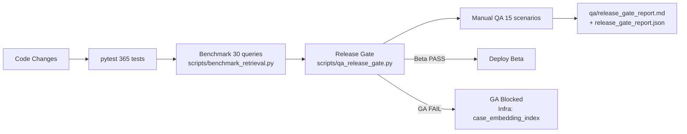
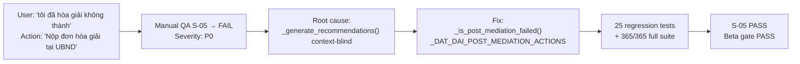

# QA Results Summary — LexAI / ULKA

**Date:** 2026-05-30  
**Version:** Beta 1.0 (commit 11a5510 + S-05 fix)

---

## 1. Automated Test Suite

| Suite | Count | Status |
|---|---|---|
| Engine unit tests | ~120 | ✅ All pass |
| Evidence tests | ~60 | ✅ All pass |
| API endpoint tests | ~80 | ✅ All pass |
| S-05 regression tests (post-mediation) | 25 | ✅ All pass |
| Other (integration, validation, memory) | ~80 | ✅ All pass |
| **Total** | **365** | **✅ 365/365 pass** |

```
pytest tests/ -q
...
365 passed in 44.xx s
```

---

## 2. Retrieval Benchmark

**Mode:** `http` — live backend, real domain classifier  
**Queries:** 30 (6 domains + general + no-diacritics + multi-domain + non-legal)

| Metric | Value | Target | Status |
|---|---|---|---|
| Top-1 domain accuracy | **96.6%** (28/29 non-general) | ≥85% | ✅ |
| Top-3 domain accuracy | **96.6%** | ≥90% | ✅ |
| Cross-domain error | **0.0%** | 0% | ✅ |
| Empty rate | **0.0%** | 0% | ✅ |
| Fallback/demo rate | **100.0%** | ≤30% | ❌ infra |
| Avg top-1 score | **0.52** | ≥0.55 | ❌ infra |

**Lưu ý quan trọng:** `fallback_demo_rate = 100%` và `avg_score = 0.52` là **hệ quả infrastructure**, không phải lỗi logic. Atlas M0 giới hạn 3 vector indexes → `case_embedding_index` chưa tạo được → tất cả similar case queries trả về demo fallback với score cố định 0.50. Domain classifier và law retrieval hoạt động bình thường.

### Accuracy Progression

| Checkpoint | Top-1 Accuracy | Ghi chú |
|---|---|---|
| Baseline (trước tất cả patch) | 79.3% (23/29) | Trước khi fix family/admin/no-diacritics |
| Sau P1 (labor override) | 79.3% | Q27 đã fix trước, không tăng |
| Sau P2 | **96.6%** (28/29) | +6 queries: Q15/Q16/Q17/Q24/Q25/Q26 |

### P2 Fixes Applied

| Fix | Queries Fixed | Root Cause |
|---|---|---|
| P2-A: `_FAMILY_PRIMARY_KEYWORDS` override | Q15, Q16, Q17 | `dan_su` beats `gia_dinh` trong dict ordering tie |
| P2-B: "khiếu nại" keyword + hanh_chinh fallback | Q24, Q25 | hop_dong tie + empty fallback pool |
| P2-C: `_VI_INDICATORS_NODIAC` + dat_dai no-diacritics | Q26 | No-diacritics query classified as English |

### Remaining "Failures" (Known Non-Issues)

| Query | Expected | Got | Classification |
|---|---|---|---|
| Q03 "GCN QSDĐ bị UBND thu hồi, khiếu nại ở đâu?" | dat_dai | hanh_chinh | **Ambiguous cross-domain** — cả hai domain đúng |
| Q28 "Hôm nay thời tiết đẹp, đi đâu ăn?" | general | hop_dong | **Non-legal UX issue** — excluded từ accuracy metric |

---

## 3. Manual QA

**Scenarios:** 15 tình huống thực tế  
**Tested against:** Live backend `http://localhost:8001`

| ID | Scenario | Domain | Verdict | Ghi chú |
|---|---|---|---|---|
| S-01 | Đất đai — có sổ đỏ, hàng xóm lấn chiếm | dat_dai | ✅ PASS | — |
| S-02 | Đất đai — chưa có sổ đỏ ở 20 năm | dat_dai | ✅ PASS | — |
| S-03 | GCN bị UBND thu hồi không bồi thường | dat_dai | ✅ PASS | Cross-domain ambiguous acceptable |
| S-04 | Bản photo sổ đỏ, mất bản gốc | dat_dai | ✅ PASS | — |
| S-05 | Hòa giải không thành — P0 | dat_dai | ✅ PASS | **Fixed** — xem Bug Story bên dưới |
| S-06 | Bên thuê nhà bị đuổi trái phép | hop_dong | ✅ PASS | — |
| S-07 | Bên cho thuê, người thuê không trả tiền | hop_dong | ✅ PASS | — |
| S-08 | Lao động — nợ lương 2 tháng | lao_dong | ✅ PASS | — |
| S-09 | Lao động — sa thải trái luật, không trợ cấp | lao_dong | ✅ PASS | — |
| S-10 | Gia đình — ly hôn đơn phương con 2 tuổi | gia_dinh | ✅ PASS | P0-sensitive: không được nói "không thể ly hôn" |
| S-11 | Hợp đồng ký, bên bán chậm giao nhà | hop_dong | ✅ PASS | — |
| S-12 | Đặt cọc 50 triệu, chưa ký HĐ | hop_dong | ✅ PASS | — |
| S-13 | No-diacritics "toi bi sai thai" | general | ✅ PASS | P1: domain=general, content đúng |
| S-14 | Multi-domain — sa thải + đất đai | lao_dong | ✅ PASS | — |
| S-15 | Non-legal — thời tiết Hà Nội | general | ✅ PASS | — |

**Total: 15/15 PASS** (sau khi fix S-05 và retest)

---

## 4. Release Gate

```
Beta release: ✅ PASS
GA release:   ❌ FAIL
```

| Gate | Status | Lý do |
|---|---|---|
| HG-1: P0 contradictions = 0 | ✅ | clean |
| HG-2: Forbidden phrases = 0 | ✅ | clean |
| HG-3: API 500 errors = 0 | ✅ | clean |
| HG-4: Demo labelling correct | ✅ | is_demo=true khi dùng fallback |
| HG-5: Cross-domain error = 0% | ✅ | clean |
| HG-6: Score threshold leak = 0 | ✅ | clean |
| Benchmark gate | ❌ | fallback_demo_rate 100% > 30% target |
| Manual QA gate | ✅ | 15/15 pass (sau retest S-05) |

**GA blocker duy nhất còn lại:** `case_embedding_index` không thể tạo trên Atlas M0.

---

## 5. Real Bug Stories

### Bug 1 — B-SOD-P0: Có sổ đỏ nhưng vẫn gợi ý "thu thập sổ đỏ"

**Phát hiện:** Deep audit v1 (manual review + automated contradiction scan)

**Mô tả:** Người dùng nói "tôi đã có sổ đỏ" → evidence extractor nhận ra `land_certificate=PRESENT` → nhưng `recommended_actions` vẫn chứa "Chuẩn bị sổ đỏ/GCN QSDĐ để bổ sung hồ sơ".

**Root cause:** `recommended_actions` template được generate từ domain template cố định, không đọc evidence snapshot của session.

**Fix:** `OutputValidator` (`src/engine/output_validator.py`)
- Regex pattern `_LAND_SUPPLEMENT_RE`: detect "supplement verb + land alias" trong action text
- Khi `land_certificate=PRESENT`: rewrite action để bỏ phần "thu thập sổ đỏ"
- Khi action hoàn toàn là "đi lấy sổ đỏ": xóa action đó

**Tests added:** `tests/api/test_threshold_filtering.py`, `tests/engine/` evidence tests

**Kết quả:** S-01 "có sổ đỏ, hàng xóm lấn chiếm" → actions không còn gợi ý thu thập sổ đỏ. ✅

---

### Bug 2 — B-S05-P0: Hòa giải không thành nhưng vẫn gợi ý hòa giải lại

**Phát hiện:** Manual QA scenario S-05 — tester nhận thấy contradiction P0.

**Mô tả:**

Input:
```
Tôi đã hòa giải ở xã nhưng không thành,
hàng xóm vẫn lấn đất và không ký biên bản.
```

Output cũ (bug):
```
recommended_actions[3]:
"Nộp đơn yêu cầu hòa giải tại UBND cấp xã —
bắt buộc theo Điều 202 Luật Đất đai trước khi khởi kiện."
```

**Root cause:** `_generate_recommendations()` trong `orchestrator.py` dùng `_DOMAIN_RECOMMENDED_ACTIONS["dat_dai"][:3]` không điều kiện — không đọc situation text để biết người dùng đã hoàn thành bước này.

**Fix:** `src/engine/orchestrator.py` — 4 thay đổi:

1. Thêm `_POST_MEDIATION_SIGNALS` (16 phrases, diacritics + no-diacritics)
2. Thêm `_DAT_DAI_POST_MEDIATION_ACTIONS` (5 actions hướng đến khởi kiện)
3. Thêm `_is_post_mediation_failed(situation) -> bool` helper
4. `_generate_recommendations()` + `_synthesize_assessment()` — khi dat_dai + post_mediation_failed: switch toàn bộ action set

Output sau fix:
```
recommended_actions:
- "Lưu giữ biên bản hòa giải không thành từ UBND xã — đây là tài liệu bắt buộc khi nộp đơn khởi kiện."
- "Tổng hợp chứng cứ ranh giới: bản đồ địa chính, ảnh hiện trạng lấn chiếm..."
- "Chuẩn bị hồ sơ khởi kiện tại Tòa án nhân dân cấp huyện nơi có đất."

key_action:
"Bước ưu tiên nhất: chuẩn bị hồ sơ khởi kiện tại Tòa án nhân dân cấp huyện
— bạn đã hoàn thành bước hòa giải bắt buộc tại UBND xã."
```

**Regression tests:** `tests/engine/test_post_mediation_actions.py` — **25 tests**

```
test_detector_true_for_post_mediation          [8 parametrized]
test_detector_false_for_pre_mediation          [4 parametrized]
test_s05_no_ubnd_mediation_action_after_failed_mediation
test_s05_post_mediation_actions_contain_court_guidance
test_pre_mediation_includes_ubnd_step
test_pre_mediation_uses_standard_dat_dai_actions
test_dat_dai_post_mediation_action_list_has_no_ubnd_mediation
test_other_domains_not_affected_by_post_mediation_fix [5 parametrized]
test_no_diacritics_post_mediation_detected     [3 parametrized]
```

**Kết quả:** S-05 PASS. 365/365 total tests pass. ✅

---

## 6. QA Pipeline Diagram



---

## 7. Bug Remediation Flow


