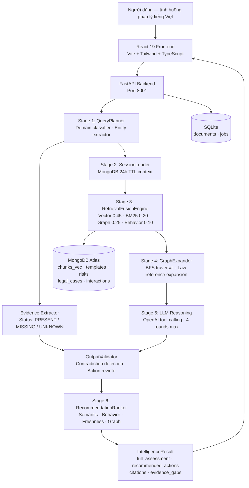

# Technical Document — LexAI / ULKA

**Version:** Beta 1.0  
**Date:** 2026-05-30  
**Stack:** Python 3.11 · FastAPI · MongoDB Atlas · sentence-transformers · React 19  

---

## 1. Executive Summary

LexAI là một Legal Intelligence Infrastructure cho người dùng Việt Nam. Khác với chatbot pháp lý thông thường, LexAI không chỉ trả lời câu hỏi — hệ thống **truy xuất evidence từ input người dùng**, **kiểm tra mâu thuẫn** giữa output và evidence đã biết, và **tự điều chỉnh action template** theo trạng thái pháp lý thực tế của người dùng.

**Kết quả đo lường:**
- 365/365 automated tests pass
- Top-1 domain accuracy: 96.6% (28/29 non-general queries)
- Cross-domain error: 0%
- Beta gate: PASS
- Manual QA: 15/15 scenarios (sau retest S-05)

---

## 2. MVP Scope

### Trong phạm vi MVP hiện tại
- Phân tích tình huống pháp lý tiếng Việt (6 domain + general)
- Evidence status extraction (có/chưa có, đã/chưa làm, PRESENT/MISSING/UNKNOWN)
- MongoDB Vector Search trên `chunks_vec` (384-dim cosine)
- Hybrid retrieval fusion: Vector + BM25 + Graph + Behavior
- Context-aware action templates (post-mediation dat_dai detection)
- Output validation — loại bỏ contradiction với known evidence
- Similar cases retrieval (demo fallback khi thiếu vector index)
- QA automation: smoke tests, benchmark, release gate

### Ngoài phạm vi
- Không thay thế luật sư
- Không đưa ra quyết định pháp lý cuối cùng
- `legal_cases` vector search chưa có index (Atlas M0 limit → 100% fallback/demo)
- Chưa GA (1 infra blocker còn lại)

---

## 3. System Architecture



---

## 4. Backend Modules

### 4.1 Query Planner (Stage 1)
**File:** `src/engine/query_planner.py`

Phân loại domain bằng keyword scoring thuần (không LLM, <10ms):

| Domain | Ví dụ keyword |
|---|---|
| `dat_dai` | đất, sổ đỏ, quyền sử dụng đất, thu hồi, lấn chiếm |
| `lao_dong` | lao động, sa thải, lương, bhxh, tai nạn lao động |
| `gia_dinh` | ly hôn, nuôi con, hôn nhân, cấp dưỡng |
| `dan_su` | thừa kế, di chúc, bồi thường dân sự |
| `hop_dong` | hợp đồng, vi phạm, đặt cọc, phạt |
| `hanh_chinh` | khiếu nại, quyết định hành chính, ubnd |
| `general` | fallback khi không có domain nào đủ score |

Hỗ trợ no-diacritics: `_VI_INDICATORS_NODIAC` phát hiện "so do", "hoa giai", "sa thai"...

**Output:** `QueryPlan` dataclass (plan_id, detected_domain, domain_confidence, extracted_entities, query_variants...)

### 4.2 Evidence Extractor
**Files:** `src/evidence/`

Nhận diện trạng thái bằng chứng từ câu hỏi:

```python
class EvidenceStatus(Enum):
    PRESENT  = "present"   # người dùng đã có / đã làm
    MISSING  = "missing"   # người dùng chưa có / chưa làm
    UNKNOWN  = "unknown"   # không rõ
```

Ví dụ:
- "tôi đã có sổ đỏ" → `land_certificate: PRESENT`
- "chưa có sổ đỏ" → `land_certificate: MISSING`
- "đã hòa giải không thành" → `ubnd_mediation: PRESENT (failed)`

### 4.3 Retrieval Fusion Engine (Stage 3)
**File:** `src/engine/retrieval_fusion.py`

4 tín hiệu retrieval được chuẩn hóa min-max độc lập rồi cộng có trọng số:

| Signal | Weight | Method |
|---|---|---|
| Vector | 0.45 | MongoDB `$vectorSearch` — 384-dim cosine |
| BM25 | 0.20 | TF-based keyword density (no corpus IDF) · scaled ×20 |
| Graph | 0.25 | Law-reference keyword expansion (BFS graph traversal) |
| Behavior | 0.10 | Collaborative filter từ interaction history |

Threshold: `FUSION_VECTOR_SIGNAL_THRESHOLD = 0.55` (override qua env var)

Query filter: `{$or: [{user_id: <user>}, {is_global: true}]}` — luôn include global admin docs

### 4.4 Output Validator
**File:** `src/engine/output_validator.py`

Lớp an toàn sau LLM — loại bỏ action mâu thuẫn với PRESENT evidence:

```
Rule: nếu evidence item status=PRESENT,
      không được có action chứa supplement verb + cùng item đó
```

Ví dụ: nếu `land_certificate=PRESENT`, action chứa "thu thập sổ đỏ" hoặc "xin cấp sổ đỏ" → bị rewrite/xóa.

Pattern matching: `_LAND_SUPPLEMENT_RE` — regex diacritics + no-diacritics variants

### 4.5 Post-Mediation Context Fix (S-05)
**File:** `src/engine/orchestrator.py`

```python
_POST_MEDIATION_SIGNALS = [
    "hòa giải không thành", "biên bản hòa giải không thành",
    "đã hòa giải tại ubnd", "hòa giải rồi", ...  # 16 signals (diacritics + no-diacritics)
]
```

Khi `detected_domain == "dat_dai"` và situation chứa post-mediation signal:
- **Thay** `recommended_actions` từ template UBND mediation → `_DAT_DAI_POST_MEDIATION_ACTIONS` (5 actions hướng đến khởi kiện)
- **Thay** `key_action` sang "chuẩn bị hồ sơ khởi kiện tại Tòa án nhân dân cấp huyện"

### 4.6 Recommendation Ranker (Stage 6)
**File:** `src/engine/recommendation_ranker.py`

6-signal reranking:

| Signal | Weight | Description |
|---|---|---|
| Semantic | 0.35 | Cosine similarity với query |
| Graph | 0.20 | Graph centrality / edge weight |
| Behavior | 0.15 | User interaction history boost |
| Freshness | 0.15 | `exp(-ln(2)/180 * days)` — half-life 180 ngày |
| Popularity | 0.10 | Aggregate view/save count |
| Accepted | 0.05 | Prior accepted recommendations |

Weights validation: raises `ValueError` nếu tổng ≠ 1.0 ±0.02

### 4.7 Session Store (Stage 2)
**File:** `src/memory/session_store.py`

- MongoDB collection `conversation_sessions` — 24h TTL index trên `last_active`
- Lưu: conversation history, law_type_preferences, evidence_snapshot
- Hỗ trợ cross-turn consistency

---

## 5. Frontend Modules

**Framework:** React 19 + TypeScript + Vite + Tailwind  
**API base:** `http://localhost:8001` (override với `VITE_API_URL`)

| Page | Chức năng |
|---|---|
| `/analyze` | Legal situation chat — full pipeline |
| `/dashboard` | Summary + proactive recommendations + behavior chart |
| `/evidence-gap` | Evidence gap analysis + Save to history |
| `/similar-cases` | Similar case explorer (demo fallback badge) |
| `/law-search` | Vector law retrieval |
| `/clause-coach` | Contract clause analysis |
| `/timeline` | Legal procedure timeline |
| `/history` | Analysis history (LocalStorage + backend sync) |
| `/profile` | User memory + AI-remembered info |
| `/admin/*` | Admin upload, document management, stats |

---

## 6. Data Flow — End to End

```
1. Người dùng nhập situation (tiếng Việt, có/không dấu)
   ↓
2. QueryPlanner.plan(query)
   → detect domain (keyword scoring, <10ms)
   → extract entities (regex: sổ đỏ, hòa giải, sa thải...)
   → generate 2-4 query variants
   ↓
3. EvidenceExtractor.extract(query)
   → classify evidence items: PRESENT / MISSING / UNKNOWN
   ↓
4. SessionLoader.load_context(session_id)
   → load 24h MongoDB session
   → prepend prior evidence_snapshot
   ↓
5. RetrievalFusionEngine.fuse(plan, user_id)
   → MongoDB $vectorSearch (cosine, threshold 0.55)
   → BM25 keyword density
   → Graph-expanded law reference keywords
   → Behavior boost
   → min-max normalize → weighted sum
   ↓
6. GraphExpander.expand(law_references)
   → BFS traversal (depth ≤ 3)
   → Edge weights: OVERRIDES 0.92 > AMENDS 0.85 > CITES 0.70
   ↓
7. LLM Reasoning (OpenAI tool-calling, max 4 rounds)
   → tools: retrieve_law_chunks, retrieve_similar_cases,
            get_graph_context, assess_legal_position, draft_legal_response
   → fallback: deterministic assessment nếu LLM unavailable
   ↓
8. OutputValidator.validate(actions, evidence_snapshot)
   → remove/rewrite actions contradicting PRESENT evidence
   → post-mediation: switch to _DAT_DAI_POST_MEDIATION_ACTIONS if triggered
   ↓
9. RecommendationRanker.rank(results, session_context)
   → 6-signal reranking
   ↓
10. Persist: save_trace() · save_context() · log_interaction()
    ↓
11. Return IntelligenceResult → Frontend
```

---

## 7. QA and Release Gate

### Automated Test Suite
| Suite | Count | Description |
|---|---|---|
| Engine tests | ~120 | QueryPlanner, orchestrator, retrieval fusion, reranking |
| Evidence tests | ~60 | Evidence extraction, normalization, gap detection |
| API tests | ~80 | Endpoint smoke tests, threshold filtering |
| Regression tests | 25 | Post-mediation fix (S-05 P0) |
| Other | ~80 | Integration, validation, memory |
| **Total** | **365** | **All pass** |

### Retrieval Benchmark
- **30 queries** covering all 6 domains + general + no-diacritics
- Metric targets vs. results: (xem [QA_RESULTS_SUMMARY.md](QA_RESULTS_SUMMARY.md))
- Mode: `http` — live backend with real domain classifier

### Release Gate Script
**File:** `scripts/qa_release_gate.py`

Tự động kiểm tra:
- Benchmark metrics vs. targets
- Manual QA pass rate
- Hard gates (P0 contradictions, forbidden phrases, 500 errors, demo labelling...)
- Output: `qa/release_gate_report.md` + `qa/release_gate_report.json`

---

## 8. Limitations

| Limitation | Root cause | Impact |
|---|---|---|
| `case_embedding_index` không tồn tại | Atlas M0 giới hạn 3 vector search indexes | Similar cases 100% demo fallback |
| `fallback_demo_rate = 100%` | Hệ quả của limitation trên | GA gate FAIL |
| Q28 (non-legal) domain = hop_dong | Không có zero-score guard | Minor UX issue |
| Q03 domain = hanh_chinh thay vì dat_dai | Cross-domain ambiguous query | Documented, not a bug |
| Chưa lawyer-in-the-loop | Scope MVP | Roadmap mid-term |

---

## 9. Roadmap

### Short-term (1–2 tháng)
- Upgrade Atlas M0 → M10+ → tạo `case_embedding_index` → GA gate PASS
- Seed thêm legal cases từ thực tế
- Non-legal query guard (domain=general khi total score < threshold)

### Mid-term (3–6 tháng)
- Contract upload + clause risk analysis
- Legal document viewer với citation highlighting
- Retrieval analytics dashboard
- Evaluation dataset mở rộng 50+ manual scenarios

### Long-term (6–12 tháng)
- Lawyer-in-the-loop review workflow
- Enterprise legal workflow integration
- Multilingual support (English, Khmer)
- Court / government procedure automation
- Production monitoring + alerting
