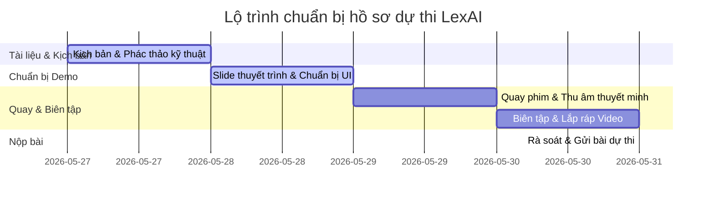

# LỘ TRÌNH CHUẨN BỊ HỒ SƠ DỰ THI — LEXAI (ULKA)
⏰ **Hạn chót nộp bài**: 18:00 VNT, Thứ Bảy 31/05/2026 (Không gia hạn)

> [!IMPORTANT]
> Bộ hồ sơ dự thi gồm 2 phần bắt buộc:
> 1. **Video Demo (Tối đa 10 phút)**: Giới thiệu bài toán, demo giải pháp thực tế, kết quả và điểm nổi bật.
> 2. **Tài liệu kỹ thuật**: MVP và kiến trúc hệ thống, Data schema MongoDB, mô tả Vector Search và Aggregation Pipeline.

---

## 📅 Lộ trình hành động chi tiết (27/05/2026 – 31/05/2026)

Dưới đây là kế hoạch hành động 5 ngày từ thứ Tư đến thứ Bảy để đảm bảo nộp hồ sơ chất lượng cao nhất và có khoảng đệm an toàn đề phòng sự cố kỹ thuật.

### Thứ Tư, 27/05/2026 — Hoàn tất Khung Tài liệu & Kịch bản chi tiết
- [x] **Đầu việc 1**: Thống nhất kịch bản phân cảnh chi tiết cho Video Demo, đảm bảo thời lượng tối ưu dưới 10 phút.
- [x] **Đầu việc 2**: Hoàn thành tài liệu kỹ thuật hệ thống chuyên sâu, trích dẫn chính xác code thực tế từ file `mongo_storage.py` về Vector Search và các Aggregation Pipelines (Collaborative Filtering, Bigram patterns).
- [ ] **Đầu việc 3**: Tạo các file tài liệu và kịch bản hoàn chỉnh vào thư mục `video/` để sẵn sàng làm tài liệu tham khảo cho các bước tiếp theo.

### Thứ Năm, 28/05/2026 — Chuẩn bị Slide & Kiểm thử UI Demo
- [ ] **Đầu việc 1**: Soạn Slide thuyết trình (khoảng 5-6 slides) bao gồm:
  - Slide 1: Tiêu đề & Đội thi.
  - Slide 2: Vấn đề (Hạn chế của RAG truyền thống khi áp dụng vào luật Việt Nam).
  - Slide 3: Giải pháp: Hệ thống LexAI & Quy trình Staged Pipeline (Ingestion + Query).
  - Slide 4: Điểm nhấn công nghệ MongoDB Atlas (Vector Search + Aggregation).
  - Slide 5: Tác động, tính ứng dụng thực tế và định hướng phát triển.
- [ ] **Đầu việc 2**: Kiểm thử hệ thống UI (React) và API backend tại local:
  - Khởi động backend (`python -m uvicorn src.api.app:app --port 8001`) và frontend (`npm run dev`).
  - Đảm bảo cơ sở dữ liệu MongoDB Atlas đã được seed đầy đủ dữ liệu thông qua lệnh `python scripts/seed_raw_data.py`.
  - Chạy thử luồng staged chat với các câu hỏi thực tế về đất đai, hợp đồng để chắc chắn phản hồi dưới 5 giây.
  - Kiểm tra Admin Panel, đảm bảo luồng upload tài liệu và xử lý qua 8-stage pipeline hoạt động mượt mà.

### Thứ Sáu, 29/05/2026 — Quay màn hình Demo & Thu âm thuyết minh
- [ ] **Đầu việc 1**: Quay màn hình các phân cảnh UI thực tế theo kịch bản `kich_ban_video_demo.md`:
  - Khuyến nghị sử dụng OBS Studio hoặc Camtasia với độ phân giải tối thiểu 1080p, tốc độ 60fps để có hình ảnh sắc nét.
  - Quay từng phân đoạn nhỏ (Dashboard, Staged Chat, Clause Coach, Admin Panel) để dễ cắt ghép và tránh lỗi phải quay lại từ đầu.
- [ ] **Đầu việc 2**: Ghi âm giọng thuyết minh (voiceover):
  - Lựa chọn không gian yên tĩnh, sử dụng mic chất lượng tốt hoặc tính năng lọc ồn AI.
  - Đọc rõ ràng, mạch lạc theo lời thoại đã soạn sẵn trong kịch bản. Tốc độ đọc vừa phải, chuyên nghiệp.

### Thứ Bảy, 30/05/2026 — Biên tập Video & Rà soát Tài liệu kỹ thuật
- [ ] **Đầu việc 1**: Biên tập video:
  - Ghép các phân đoạn quay màn hình khớp với giọng nói thuyết minh.
  - **Rất quan trọng**: Sử dụng hiệu ứng phóng to (zoom-in) vào các phần quan trọng trên giao diện như:
    - Sơ đồ stage đang xử lý trên Chat Interface.
    - Trích dẫn điều khoản luật chi tiết có nguồn gốc rõ ràng.
    - Các biểu đồ hành vi tương tác trên Dashboard.
    - Trạng thái xử lý job thành công trong Admin Panel.
  - Thêm phụ đề (subtitle) tiếng Việt ở các phần thuyết minh quan trọng để ban giám khảo dễ theo dõi ngay cả khi tắt tiếng.
  - Kiểm soát tổng thời lượng video **không vượt quá 10 phút** (khuyến nghị trong khoảng 8 - 9 phút để cô đọng).
- [ ] **Đầu việc 2**: Hoàn thiện tài liệu kỹ thuật, xuất ra định dạng PDF đẹp mắt để chuẩn bị nộp bài.

### Chủ Nhật, 31/05/2026 — Gửi bài dự thi (Trước hạn chót 18:00 VNT)
- [ ] **Đầu việc 1**: Upload video lên YouTube dưới chế độ **Không công khai (Unlisted)** hoặc Google Drive (đảm bảo đã mở quyền truy cập công khai cho bất kỳ ai có liên kết).
- [ ] **Đầu việc 2**: Rà soát bộ hồ sơ nộp bài lần cuối theo checklist.
- [ ] **Đầu việc 3**: Gửi bài thi trên cổng thông tin chính thức của BTC. Khuyến nghị gửi trước **15:00 VNT** để đề phòng nghẽn mạng giờ chót.

---

## 🎯 Checklist đối chiếu tiêu chí chấm điểm của Ban giám khảo

Để đảm bảo đạt điểm số tối đa, bộ hồ sơ của chúng ta cần tự kiểm tra nghiêm ngặt theo các tiêu chí sau:

| Tiêu chí | Trọng số | Yêu cầu đối chiếu trong hồ sơ của LexAI | Trạng thái tự đánh giá |
| :--- | :---: | :--- | :---: |
| **Sáng tạo / Nguyên bản** | **30%** | - Làm nổi bật kiến trúc staged pipeline 7 bước xử lý truy vấn thông minh thay vì RAG thô. - Nhấn mạnh cơ chế Reflection daemon tự động học sở thích người dùng từ hội thoại. - Trình bày các gợi ý chủ động (Proactive) và gợi ý hành động tiếp theo (Next Best Actions). | 🟢 Đã tối ưu |
| **Triển khai kỹ thuật** | **30%** | - Chứng minh việc tích hợp sâu sắc MongoDB Atlas (Vector Search cho RAG và các Aggregation Pipelines để gợi ý cộng tác, khai phá mẫu hành vi). - Tốc độ phản hồi cực nhanh (Stage 1 <10ms, fallback offline tự động không phụ thuộc LLM). - Code backend sạch, phân tách module rõ ràng, xử lý luồng ingestion 8 bước đồng bộ SQLite + MongoDB. | 🟢 Đã tối ưu |
| **Ảnh hưởng / Tiềm năng** | **30%** | - Giải quyết bài toán tra cứu và phân tích luật Việt Nam cực kỳ nhức nhối đối với cả người dân lẫn luật sư. - Khả năng mở rộng dễ dàng (chỉ cần admin tải tài liệu mới lên thông qua Ingestion Pipeline). - Cơ chế bảo mật và phân quyền dữ liệu chặt chẽ (`is_global`). | 🟢 Đã tối ưu |
| **Trình bày / Demo** | **10%** | - Video rõ ràng, âm thanh tốt, độ phân giải cao. - Sử dụng zoom hiệu quả để BGK thấy rõ chi tiết UI. - Tài liệu kỹ thuật chi tiết, chuyên nghiệp, cấu trúc rõ ràng và dễ đọc. | 🟢 Đã sẵn sàng kịch bản |

---

## 💡 Lời khuyên quan trọng cho ngày quay Demo
1. **Dọn sạch màn hình làm việc**: Tắt các thông báo cá nhân, đóng các tab trình duyệt không liên quan, ẩn thanh công cụ Taskbar nếu cần để tạo cảm giác chuyên nghiệp.
2. **Kịch bản Demo trơn tru**: Tạo sẵn tài khoản demo có lịch sử tương tác phong phú để phần đồ thị hành vi pháp lý trên Dashboard hiển thị thật sinh động và đẹp mắt.
3. **Chuẩn bị sẵn tài liệu tải lên**: Chuẩn bị sẵn một file luật PDF/DOCX thực tế để demo tính năng upload của Admin, đảm bảo file này chưa được seed trước đó để thấy rõ quá trình phân tích 8 bước.
