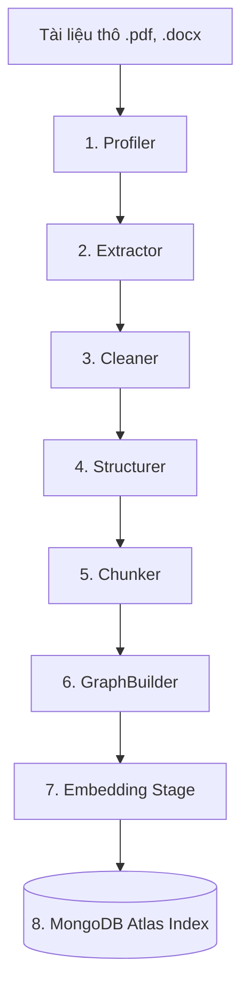
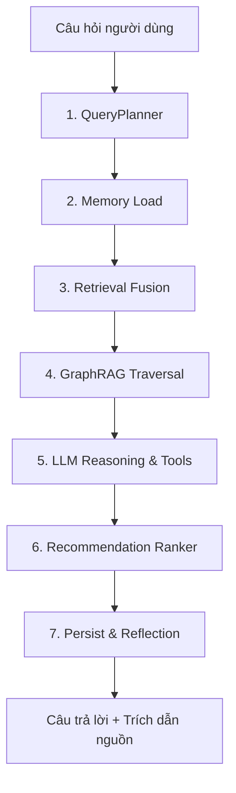

# TÀI LIỆU KỸ THUẬT HỆ THỐNG — LEXAI (ULKA)
HẠ TẦNG TRÍ TUỆ NHÂN TẠO PHÂN TÍCH VÀ TRUY XUẤT PHÁP LUẬT VIỆT NAM

> **Dự án**: Universal Legal Knowledge Assistant (LexAI / ULKA)
> **Công nghệ**: Python 3.11 · FastAPI · MongoDB Atlas · sentence-transformers (384-dim) · OpenAI API · React 19 + TypeScript + Vite + Tailwind

---

## 1. MVP VÀ KIẾN TRÚC HỆ THỐNG TỔNG THỂ

Hệ thống **LexAI** được thiết kế dưới dạng **Hạ tầng Trí tuệ Nhân tạo đa tầng (Staged AI Infrastructure)** nhằm vượt qua các giới hạn của RAG truyền thống trong việc phân tích văn bản pháp luật phức tạp của Việt Nam. Hệ thống bao gồm hai luồng xử lý xử lý song song, phối hợp nhịp nhàng:

### Luồng A — Quy trình Ingestion Dữ liệu Pháp luật (Ingestion Pipeline)
Quy trình này gồm 8 bước nghiêm ngặt chịu trách nhiệm chuyển hóa các văn bản pháp luật thô (PDF, DOCX, HTML) thành các đơn vị tri thức có cấu trúc và liên kết:
1. **Upload**: Tiếp nhận tệp tin từ Admin hoặc người dùng.
2. **Profiler**: Phân tích bố cục, định dạng, độ phức tạp của tài liệu.
3. **Extractor**: Trích xuất nội dung văn bản gốc, bảng biểu, hình ảnh.
4. **Cleaner**: Làm sạch lỗi OCR, chuẩn hóa phông chữ, định dạng văn bản pháp luật.
5. **Structurer**: Cấu trúc hóa tài liệu thành các thực thể: Điều, Khoản, Điểm có cấu trúc phân cấp.
6. **Chunker**: Cắt nhỏ văn bản theo cấu trúc điều khoản luật (Semantic Legal Chunking) thay vì cắt theo số lượng token thô.
7. **GraphBuilder**: Tạo lập các nút (Nodes) và cạnh (Edges) biểu diễn mối quan hệ pháp lý giữa các điều khoản.
8. **RetrievalStage & Index**: Nhúng (Embedding) nội dung chunk thành vector 384 chiều và lưu trữ vào chỉ mục MongoDB Atlas.



---

### Luồng B — Quy trình Xử lý Truy vấn thông minh (Query Intelligence Pipeline)
Quy trình gồm 7 giai đoạn tối ưu hóa, đảm bảo câu trả lời cuối cùng chính xác, có tính cá nhân hóa cao và trích dẫn đầy đủ nguồn gốc:
1. **QueryPlanner**: Phân tích ngữ cảnh, miền luật, trích xuất thực thể, tạo biến thể câu hỏi (<10ms, không dùng LLM).
2. **SessionMemory & UserMemory**: Nạp lịch sử hội thoại 24h và thông tin sở thích, hành vi người dùng lưu dài hạn trong MongoDB.
3. **RetrievalFusion**: Truy xuất hợp nhất 4 tín hiệu: Vector Search ($vectorSearch), BM25, Đồ thị liên kết và Boost hành vi người dùng.
4. **GraphRAG Traversal**: Duyệt đồ thị quan hệ để kiểm tra tính hiệu lực và sự ràng buộc giữa các điều luật (mối quan hệ `OVERRIDES`, `AMENDS`, `REQUIRES`, `INVALIDATES`).
5. **LLM Reasoning**: Trình suy luận LLM thực hiện vòng lặp gọi công cụ (OpenAI Tool-calling, max 4 vòng) để tập hợp bằng chứng.
6. **RecommendationRanker**: Tái xếp hạng các đề xuất dựa trên 6 tín hiệu: semantic (35%), graph (20%), behavior (15%), freshness (15%), popularity (10%), accepted (5%).
7. **Persist & Reflection**: Lưu vết suy luận (reasoning trace), lưu session chat, và kích hoạt ngầm **Reflection Agent** trích xuất thông tin người dùng đưa vào bộ nhớ lâu dài.



---

## 2. DATA SCHEMA VÀ KIẾN TRÚC DỮ LIỆU MONGODB

Để phục vụ các tính năng gợi ý cá nhân hóa và tìm kiếm vector hiệu năng cao, LexAI sử dụng cơ sở dữ liệu **MongoDB Atlas** làm động cơ trung tâm với 10 collections chuyên biệt:

### 1. `chunks_vec` (Kho lưu trữ điều khoản luật đã được nhúng vector)
- **Mục đích**: Lưu trữ các chunk văn bản pháp luật, vector nhúng và siêu dữ liệu đi kèm.
- **Indexes**:
  - `chunk_id` (Unique Index)
  - `(doc_id, user_id)` (Compound Index)
  - `law_type` (Miền luật: `dat_dai`, `lao_dong`, `hop_dong`,...)
  - `chunk_embedding_index` (Atlas Vector Search Index, 384 dimensions, cosine metric)
- **Schema**:
```json
{
  "chunk_id": "doc_123_chunk_05",
  "doc_id": "doc_123",
  "user_id": "admin",
  "content": "Điều 12. Điều kiện sang tên quyền sử dụng đất...",
  "is_global": true,
  "law_type": "dat_dai",
  "position": 5,
  "embedding": [0.0124, -0.0456, ..., 0.0892],
  "has_embedding": true,
  "updated_at": "2026-05-27T11:00:00Z"
}
```

### 2. `interactions` (Nhật ký hành vi người dùng)
- **Mục đích**: Lưu lại toàn bộ các thao tác `view`, `save`, `download`, `query` phục vụ Collaborative Filtering.
- **Indexes**:
  - `(user_id, timestamp)` (Descending compound index)
  - `doc_id`
  - `action_type`
- **Schema**:
```json
{
  "user_id": "user_999",
  "doc_id": "doc_123",
  "chunk_id": "doc_123_chunk_05",
  "action_type": "download",
  "context": {
    "law_type": "dat_dai",
    "query": "sang tên sổ đỏ khi chuyển nhượng"
  },
  "timestamp": "2026-05-27T11:20:00Z"
}
```

### 3. `user_profiles` (Hồ sơ sở thích tổng hợp của người dùng)
- **Mục đích**: Lưu trữ vector sở thích tích lũy, các miền luật hay truy cập phục vụ tìm kiếm người dùng tương đồng (User-User CF).
- **Indexes**:
  - `user_id` (Unique)
  - `user_profile_embedding_index` (Atlas Vector Search Index, 384 dimensions, cosine metric)
- **Schema**:
```json
{
  "user_id": "user_999",
  "embedding": [0.0341, -0.0112, ..., 0.0528],
  "top_law_types": ["dat_dai", "hop_dong"],
  "domain_counts": {
    "dat_dai": 15,
    "hop_dong": 8
  },
  "last_role": "Luật sư",
  "recent_queries": [
    {"q": "quy định đền bù đất đai", "domain": "dat_dai", "ts": "2026-05-27T11:15:00Z"}
  ],
  "last_active": "2026-05-27T11:22:00Z"
}
```

### 4. `user_memory` (Bộ nhớ dài hạn chéo phiên của người dùng)
- **Mục đích**: Lưu giữ thông tin cá nhân và tóm tắt tình huống pháp lý mà không có hạn TTL, giúp AI luôn hiểu ngữ cảnh người dùng.
- **Indexes**: `user_id` (Unique)
- **Schema**:
```json
{
  "user_id": "user_999",
  "personal_info": {
    "name": "Nguyễn Văn A",
    "age": 35,
    "occupation": "Kinh doanh bất động sản",
    "location": "Thành phố Hồ Chí Minh",
    "notes": "Quan tâm sâu sắc đến tranh chấp đất nông nghiệp tại Củ Chi"
  },
  "situation_summaries": [
    {
      "session_id": "sess_888",
      "date": "2026-05-27",
      "domain": "dat_dai",
      "summary": "Gặp vướng mắc về sang tên sổ đỏ do bên bán vi phạm tiến độ đặt cọc.",
      "resolved": false
    }
  ],
  "updated_at": "2026-05-27T11:22:13Z"
}
```

### 5. `legal_cases` (Kho lưu trữ án lệ và tình huống tương tự)
- **Mục đích**: Tìm kiếm các tình huống, án lệ tương đồng thông qua Vector Search.
- **Indexes**:
  - `case_id` (Unique)
  - `law_type`
  - `case_embedding_index` (Atlas Vector Search Index, 384 dimensions, cosine)

### 6. `contract_clauses` (Kho bóc tách rủi ro hợp đồng)
- **Mục đích**: Lưu vết bóc tách hợp đồng của người dùng và đối chiếu điều khoản tương tự.
- **Indexes**: `doc_id`, `user_id`, `clause_embedding_index` (Vector search index)

### 7. `templates` (Mẫu hợp đồng mẫu chuẩn)
- **Mục đích**: Gợi ý các mẫu hợp đồng pháp lý dựa trên hồ sơ người dùng.
- **Indexes**: `template_id`, `template_embedding_index` (Vector Search index)

### 8. `checklists` (Danh mục tuân thủ pháp lý)
- **Mục đích**: Gợi ý các quy trình kiểm tra pháp lý.

### 9. `conversation_sessions` (Phiên hội thoại ngắn hạn)
- **Mục đích**: Lưu vết hội thoại trong vòng 24h. Tự động dọn dẹp qua MongoDB TTL index trên trường `last_active`.

### 10. `reasoning_traces` (Lưu vết suy luận chi tiết của hệ thống)
- **Mục đích**: Phục vụ việc giám sát chất lượng và giải thích quyết định pháp lý.

---

### Mô hình cách ly dữ liệu và phân quyền (`is_global`)

Để đảm bảo tính bảo mật dữ liệu tuyệt đối cho người dùng nhưng vẫn khai thác được kho tri thức pháp luật khổng lồ của quốc gia, LexAI áp dụng mô hình phân quyền thuộc tính:
*   **Dữ liệu Admin tải lên**: Gắn nhãn `user_id: "admin"` và `is_global: true`. Mọi người dùng trong hệ thống đều có quyền truy xuất các tài liệu này.
*   **Dữ liệu User tải lên**: Gắn nhãn `user_id: "<id_nguoi_dung>"` và `is_global: false`. Chỉ duy nhất người dùng sở hữu mới có quyền truy xuất.
*   **Truy vấn an toàn**: Mọi câu lệnh truy xuất dữ liệu từ phía người dùng đều bắt buộc đi qua bộ lọc logic hợp nhất:
    `{"$or": [{"user_id": filter_user_id}, {"is_global": true}]}`

---

## 3. MÔ TẢ CÁCH ÁP DỤNG VECTOR SEARCH VÀ AGGREGATION PIPELINE

Đây là điểm sáng kỹ thuật quan trọng nhất thể hiện sức mạnh tích hợp của **MongoDB Atlas** trong việc đóng vai trò là động cơ tính toán và truy xuất thời gian thực cho hệ thống LexAI.

### A. Áp dụng Vector Search trên MongoDB Atlas

Hệ thống sử dụng các bộ nhúng vector cosine 384 chiều từ thư viện `sentence-transformers` (nhỏ gọn, hiệu năng cao, tối ưu cho tiếng Việt). Dưới đây là code PyMongo thực tế từ lớp `VectorStorage` (file `src/mongodb/mongo_storage.py`) thực hiện truy vấn Vector Search kết hợp bộ lọc cách ly dữ liệu:

```python
    def vector_search_chunks(
        self,
        query_vector: List[float],
        filter_user_id: Optional[str] = None,
        law_type: Optional[str] = None,
        limit: int = 12,
    ) -> List[Dict[str, Any]]:
        """
        MongoDB $vectorSearch over chunks_vec.embedding (cosine similarity).
        Returns chunks sorted by vector similarity descending.
        """
        pipeline: List[Dict] = [
            {
                "$vectorSearch": {
                    "index": "chunk_embedding_index",
                    "path": "embedding",
                    "queryVector": query_vector,
                    "numCandidates": limit * 10,
                    "limit": limit * 2,  # Lấy dư để phục vụ post-filter
                }
            },
            {"$addFields": {"vector_score": {"$meta": "vectorSearchScore"}}},
        ]

        # Post-filter: Cách ly dữ liệu cá nhân của user HOẶC lấy tài liệu toàn cầu của hệ thống
        post_match: Dict[str, Any] = {}
        if filter_user_id:
            post_match["$or"] = [{"user_id": filter_user_id}, {"is_global": True}]
        if law_type:
            post_match["law_type"] = law_type
        if post_match:
            pipeline.append({"$match": post_match})

        pipeline += [
            {"$limit": limit},
            {
                "$project": {
                    "_id": 0,
                    "embedding": 0,  # Không trả về vector nhúng để tiết kiệm băng thông mạng
                }
            },
        ]

        try:
            return list(self.chunks.aggregate(pipeline))
        except Exception as exc:
            logger.warning("vector_search_chunks failed: %s", exc)
            return []
```

> [!TIP]
> **Điểm nổi bật kỹ thuật**: Việc sử dụng `$vectorSearch` trực tiếp trong cấu trúc Aggregation Pipeline của MongoDB giúp kết hợp mượt mà giữa tìm kiếm ngữ nghĩa không cấu trúc (semantic search) và các phép lọc logic có cấu trúc (metadata filtering) chỉ trong duy nhất một lượt gọi mạng database, giảm tối đa độ trễ phản hồi hệ thống.

---

### B. Áp dụng Aggregation Pipeline cho các tính năng gợi ý nâng cao

LexAI không sử dụng các dịch vụ bên thứ ba để xây dựng hệ gợi ý cá nhân hóa phức tạp. Thay vào đó, chúng tôi khai thác triệt để sức mạnh của **MongoDB Aggregation Framework** để thực hiện các thuật toán học máy trực tiếp trên cơ sở dữ liệu.

#### 1. Hệ gợi ý Lọc cộng tác dựa trên Tài liệu (Document-based Collaborative Filtering)
Thuật toán tìm kiếm: *"Những người dùng đã tương tác với văn bản X cũng có xu hướng tương tác nhiều nhất với văn bản Y"*. Hệ thống tính toán điểm số cộng tác dựa trên trọng số hành vi: hành động tải xuống (`download`) có trọng số cao nhất (3.0), tiếp theo là lưu trữ (`save` - 2.0) và xem (`view` - 1.0).

```python
    def collaborative_filter_docs(
        self,
        user_viewed_doc_ids: List[str],
        current_user_id: str,
        limit: int = 10,
    ) -> List[Dict[str, Any]]:
        """
        MongoDB Aggregation Pipeline — collaborative filtering
        """
        if not user_viewed_doc_ids:
            return []

        pipeline: List[Dict] = [
            # Bước 1: Tìm các người dùng KHÁC đã từng tương tác với cùng tập tài liệu này
            {
                "$match": {
                    "doc_id": {"$in": user_viewed_doc_ids},
                    "user_id": {"$ne": current_user_id},
                }
            },
            {"$group": {"_id": "$user_id"}},
            
            # Bước 2: Liên kết ($lookup) để lấy TẤT CẢ các tương tác của tập người dùng tương đồng đó
            {
                "$lookup": {
                    "from": "interactions",
                    "localField": "_id",
                    "foreignField": "user_id",
                    "as": "their_interactions",
                }
            },
            {"$unwind": "$their_interactions"},
            
            # Bước 3: Loại bỏ các tài liệu mà người dùng hiện tại ĐÃ xem qua
            {
                "$match": {
                    "their_interactions.doc_id": {"$nin": user_viewed_doc_ids}
                }
            },
            
            # Bước 4: Nhóm theo tài liệu đồng xuất hiện và tính điểm số cộng tác có gán trọng số hành vi
            {
                "$group": {
                    "_id": "$their_interactions.doc_id",
                    "collab_score": {
                        "$sum": {
                            "$switch": {
                                "branches": [
                                    {"case": {"$eq": ["$their_interactions.action_type", "download"]}, "then": 3.0},
                                    {"case": {"$eq": ["$their_interactions.action_type", "save"]}, "then": 2.0},
                                    {"case": {"$eq": ["$their_interactions.action_type", "view"]}, "then": 1.0},
                                ],
                                "default": 0.5,
                            }
                        }
                    },
                    "similar_user_count": {"$addToSet": "$_id"},
                }
            },
            {"$sort": {"collab_score": -1}},
            {"$limit": limit},
            {
                "$project": {
                    "_id": 0,
                    "doc_id": "$_id",
                    "collab_score": 1,
                    "similar_user_count": {"$size": "$similar_user_count"},
                }
            },
        ]
        try:
            return list(self.interactions.aggregate(pipeline))
        except Exception as exc:
            logger.warning("collaborative_filter_docs failed: %s", exc)
            return []
```

---

#### 2. Khai phá chuỗi hành vi kế tiếp (Bigram Action Sequence Mining)
Tính năng **Next Best Actions (NBA)** trên Dashboard phân tích trình tự hành vi lịch sử theo thời gian của người dùng để dự đoán hành động tiếp theo thích hợp nhất. Việc này được thực hiện thông qua Aggregation Pipeline phức tạp kết hợp toán tử mảng nâng cao:

```python
    def get_user_action_bigrams(
        self,
        user_id: str,
        limit: int = 20,
    ) -> List[Dict[str, Any]]:
        """
        Khai phá mẫu chuỗi hành động (action_N, action_N+1) theo trình tự thời gian.
        """
        pipeline = [
            {"$match": {"user_id": user_id}},
            {"$sort": {"timestamp": 1}},
            {"$group": {"_id": None, "actions": {"$push": "$action_type"}}},
            {
                "$project": {
                    "_id": 0,
                    # Sử dụng $map và $range để tạo các cặp bigram kề nhau trong mảng hành động
                    "bigrams": {
                        "$map": {
                            "input": {
                                "$range": [
                                    0,
                                    {"$subtract": [{"$size": "$actions"}, 1]},
                                ]
                            },
                            "as": "i",
                            "in": {
                                "first": {"$arrayElemAt": ["$actions", "$$i"]},
                                "second": {
                                    "$arrayElemAt": [
                                        "$actions",
                                        {"$add": ["$$i", 1]},
                                    ]
                                },
                            },
                        }
                    },
                }
            },
            {"$unwind": "$bigrams"},
            {
                "$group": {
                    "_id": {
                        "first": "$bigrams.first",
                        "second": "$bigrams.second",
                    },
                    "count": {"$sum": 1},
                }
            },
            {"$sort": {"count": -1}},
            {"$limit": limit},
            {
                "$project": {
                    "_id": 0,
                    "first_action": "$_id.first",
                    "second_action": "$_id.second",
                    "count": 1,
                }
            },
        ]
        try:
            return list(self.interactions.aggregate(pipeline))
        except Exception as exc:
            logger.warning("get_user_action_bigrams failed: %s", exc)
            return []
```

---

#### 3. Cập nhật và Đồng bộ Vector Sở thích Người dùng (User Profile Embedding - User-User CF)
Để thực hiện tìm kiếm các người dùng có cùng hệ quan điểm pháp lý (User-User Collaborative Filtering), LexAI tính toán một **Vector sở thích đại diện (profile embedding)** cho mỗi người dùng. Vector này được sinh ra từ trung bình có trọng số của các vector chunk mà người dùng đã tương tác (nhận trọng số cao hơn nếu tải xuống hoặc lưu trữ) sau đó thực hiện chuẩn hóa L2.

```python
    def update_user_profile_embedding(self, user_id: str) -> bool:
        """
        Tính toán vector sở thích pháp lý tổng hợp của người dùng và lưu trữ vào 'user_profiles'.
        """
        # Bước 1: Tổng hợp danh sách chunk người dùng đã tương tác và gán trọng số
        pipeline = [
            {
                "$match": {
                    "user_id": user_id,
                    "chunk_id": {"$exists": True, "$ne": None},
                }
            },
            {"$sort": {"timestamp": -1}},
            {"$limit": 100},
            {
                "$addFields": {
                    "weight": {
                        "$switch": {
                            "branches": [
                                {"case": {"$eq": ["$action_type", "download"]}, "then": 3.0},
                                {"case": {"$eq": ["$action_type", "save"]}, "then": 2.0},
                                {"case": {"$eq": ["$action_type", "view"]}, "then": 1.0},
                            ],
                            "default": 0.5,
                        }
                    }
                }
            },
            {
                "$group": {
                    "_id": "$chunk_id",
                    "weight": {"$max": "$weight"},
                }
            },
        ]
        try:
            chunk_weights = {r["_id"]: r["weight"] for r in self.interactions.aggregate(pipeline)}
            if not chunk_weights:
                return False

            # Bước 2: Lấy ra các vector nhúng tương ứng của các chunks từ collection 'chunks_vec'
            chunks = list(self.chunks.find(
                {"chunk_id": {"$in": list(chunk_weights.keys())}},
                {"chunk_id": 1, "embedding": 1, "_id": 0}
            ))
            if not chunks:
                return False

            # Bước 3: Tính trung bình có trọng số của các vector
            dim = len(chunks[0]["embedding"])
            weighted_sum = [0.0] * dim
            total_weight = 0.0
            for chunk in chunks:
                w = chunk_weights.get(chunk["chunk_id"], 1.0)
                for i, v in enumerate(chunk["embedding"]):
                    weighted_sum[i] += w * v
                total_weight += w

            if total_weight == 0:
                return False

            avg_emb = [x / total_weight for x in weighted_sum]
            
            # Chuẩn hóa L2 vector kết quả để tối ưu hóa cho tìm kiếm cosine
            norm = math.sqrt(sum(x * x for x in avg_emb))
            if norm > 0:
                avg_emb = [x / norm for x in avg_emb]

            law_types = self.get_user_law_types(user_id)
            
            # Bước 4: Lưu trữ vector sở thích vào 'user_profiles'
            self.user_profiles.update_one(
                {"user_id": user_id},
                {
                    "$set": {
                        "user_id": user_id,
                        "embedding": avg_emb,
                        "top_law_types": law_types[:3],
                        "interaction_count": len(chunk_weights),
                        "updated_at": datetime.now(timezone.utc),
                    }
                },
                upsert=True,
            )
            return True
        except Exception as exc:
            logger.warning("update_user_profile_embedding failed: %s", exc)
            return False
```

Sau khi có `user_profiles.embedding`, hệ thống có thể dễ dàng tìm ra các người dùng tương đồng sở thích bằng truy vấn `$vectorSearch` cực kỳ đơn giản để phục vụ tính năng Peer Recommendations:

```python
    def vector_search_similar_users(
        self,
        user_id: str,
        limit: int = 10,
    ) -> List[str]:
        """
        User-User CF via $vectorSearch on user_profiles.embedding
        """
        profile = self.user_profiles.find_one({"user_id": user_id}, {"embedding": 1, "_id": 0})
        if not profile or not profile.get("embedding"):
            return []

        pipeline = [
            {
                "$vectorSearch": {
                    "index": "user_profile_embedding_index",
                    "path": "embedding",
                    "queryVector": profile["embedding"],
                    "numCandidates": limit * 5,
                    "limit": limit + 1,
                }
            },
            {"$match": {"user_id": {"$ne": user_id}}},
            {"$limit": limit},
            {"$project": {"_id": 0, "user_id": 1}},
        ]
        try:
            return [r["user_id"] for r in self.user_profiles.aggregate(pipeline)]
        except Exception as exc:
            logger.warning("vector_search_similar_users failed: %s", exc)
            return []
```

---

## 4. TỔNG KẾT & TIÊU CHÍ ĐÁNH GIÁ CHẤM ĐIỂM DỰ THI

Hạ tầng hệ thống LexAI tự tin đáp ứng xuất sắc các tiêu chí đánh giá nghiêm ngặt của Ban Giám Khảo:

1.  **💡 Sáng tạo / Tính nguyên bản (30%)**:
    *   Vượt qua thiết kế RAG tuyến tính thông thường bằng kiến trúc **Staged Pipeline** phân tách rõ ràng.
    *   Phối hợp hoàn hảo giữa **Vector Search** và **GraphRAG** để giải quyết triệt để lỗi thời của luật (supersession) bằng liên kết đồ thị ngữ nghĩa.
    *   Cơ chế **Reflection Agent** tự động đúc rút tri thức chéo phiên hội thoại (cross-session memory) hoạt động hoàn toàn phi chặn dưới dạng daemon thread.
2.  **⚙️ Triển khai kỹ thuật (30%)**:
    *   Chứng minh sự tích hợp sâu sắc, thông minh và tối ưu tài nguyên của **MongoDB Atlas** (sử dụng tối đa các chỉ mục Vector, Aggregation Pipelines nâng cao cho gợi ý cộng tác, khai phá mảng hành vi, L2 normalization).
    *   Hệ thống có cơ chế phòng vệ chuyên sâu: Tự động khử độc câu lệnh nhúng đầu vào (Sanitization) và chống tấn công Prompt Injection tại tầng UserMemory.
    *   Tính ổn định cực cao nhờ cơ chế **Deterministic Fallback** tự động khi LLM bên ngoài bị gián đoạn dịch vụ.
3.  **🌍 Ảnh hưởng / Tiềm năng (30%)**:
    *   Giải quyết nhu cầu thực tế rất lớn về tra cứu và phân tích pháp lý tại Việt Nam.
    *   Kiến trúc sẵn sàng mở rộng quy mô lớn (Production-ready): Cơ chế phân vùng dữ liệu an toàn `is_global` cho phép hệ thống mở rộng phục vụ hàng triệu người dùng cùng lúc trên hạ tầng đám mây MongoDB Atlas.
